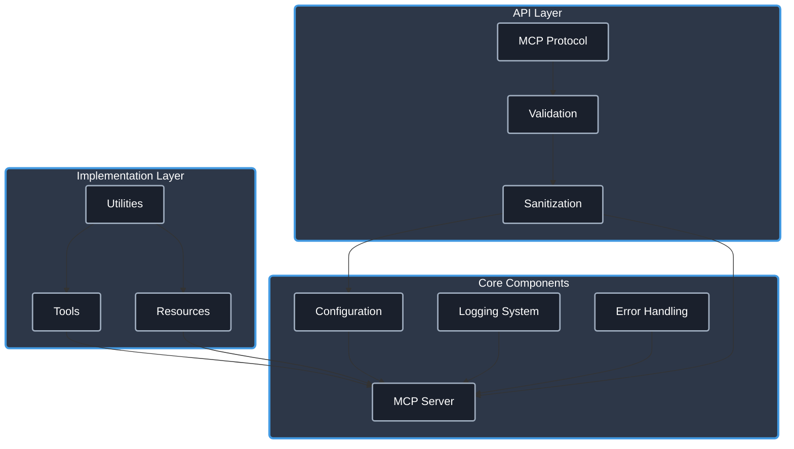

# Model Context Protocol Resources & Guides

A collection of guides, utilities, clients, and servers for the Model Context Protocol (MCP) that I've developed while exploring and implementing this powerful standard. It's a work in progress, and I'll be adding more as I continue to experiment and learn. Feel free to reach out if you have any questions! Thanks for stopping by! 🚀

## 📋 Table of Contents

- [Introduction to MCP](#introduction-to-mcp)
- [MCP TypeScript Template](#mcp-typescript-template)
- [MCP Guides](#mcp-guides)
- [MCP Utilities](#mcp-utilities)
- [MCP Servers](#mcp-servers)
  - [Atlas](#atlas-mcp-server)
  - [Toolkit](#toolkit-mcp-server)
  - [Mentor](#mentor-mcp-server)
  - [Obsidian](#obsidian-mcp-server)
  - [Git](#git-mcp-server)
  - [GitHub](#github-mcp-server)
  - [Ntfy](#ntfy-mcp-server)
  - [Scrapeless](#scrapeless-mcp-server)
- [Getting Started](#getting-started)
- [License](#license)

## 🔍 Introduction to MCP

The Model Context Protocol (MCP) is a standardized communication protocol enabling Large Language Models (LLMs) to interact with external systems and services. Benefits include:

- **Consistent Interface**: Standardized methods for LLMs to access tools and resources
- **Enhanced Capabilities**: Gives LLMs the ability to interact with databases, APIs, and local systems
- **Security & Control**: Provides structured access patterns with built-in validation
- **Extensibility**: Easy to implement new capabilities as system requirements evolve

For a more in-depth introduction to MCP, including its design philosophy and technical details, [check out the specification](https://modelcontextprotocol.io/).

## 🚀 [MCP TypeScript Template Repo](https://github.com/cyanheads/mcp-ts-template)

### ✨ Just Launched! The Ultimate Starter Kit for building MCP Servers ✨

This is a **TypeScript template** for building Model Context Protocol (MCP) servers. It provides a solid foundation for creating your own MCP server, complete with best practices, utilities, and a modular architecture.

**Whether you're a beginner or an experienced developer**, this template is designed to help you get started quickly and efficiently.

**Perfect for vibe code sessions** - grab this template and your LLM coding agent will instantly understand the architecture and patterns, allowing an easy and efficient MCP server development experience.

### What's Inside?

- **Rock-solid Architecture**: A carefully crafted structure designed for scalability and maintainability
- **Production-ready Utilities**: Logging, error handling, ID generation, and more - all battle-tested and ready to go
- **Type Safety**: Comprehensive TypeScript typing to catch errors before they happen
- **Security First**: Built-in protection against common vulnerabilities
- **Working Examples**: Fully implemented MCP server tools and resources you can use as reference
- **Developer Cheat Sheet**: A `.clinerules` file to help your LLM coding agent understand the project instantly

### Who Should Use This?

- **MCP Beginners**: Skip the learning curve and start with best practices
- **Experienced Developers**: Save time and focus on your unique features
- **Teams**: Ensure consistent patterns across your MCP ecosystem
- **LLM Enthusiasts**: Get to know MCP and give your AI assistant the perfect starting point

### Core Architecture

The template follows a modular architecture designed for clarity and extensibility:

Click to expand architecture diagram

Try out this template and build your first MCP server! Check out the [repo documentation](https://github.com/cyanheads/mcp-ts-template) for more details.

## 🛠️ MCP Guides

### [MCP Client Development Guide](guides/mcp-client-development-guide.md)

Looking to build your own MCP client? Check out my comprehensive [MCP Client Development Guide](guides/mcp-client-development-guide.md) that covers:

- Core architecture and components
- Connection lifecycle management
- Tool and resource handling
- Error handling and security best practices
- Step-by-step implementation examples in Python and TypeScript
- Advanced topics like sampling and multi-server connections

### [MCP Server Development Guide](guides/mcp-server-development-guide.md)

Looking to build your own MCP server? Check out my comprehensive [MCP Server Development Guide](guides/mcp-server-development-guide.md) that covers:

- Core server architecture
- Building your first MCP server
- Exposing capabilities (tools, resources, and prompts)
- Advanced server features (sampling, roots, streaming, etc.)
- Security and best practices
- Troubleshooting and resources
- Example implementations

## 🛠️ MCP Utilities

### [MCP Reporter](https://github.com/cyanheads/mcp-reporter)

A utility I've developed for generating comprehensive reports about Model Context Protocol (MCP) server capabilities, helping developers understand what functionality is available across their MCP server ecosystem. Can also be used programmatically to generate reports for documentation or for feeding into other tools.

- 📊 **Server Analysis**

  - Automatic discovery of all enabled MCP servers
  - Detailed capability extraction (tools, resources, templates)
  - Real-time progress monitoring during execution
  - Comprehensive metadata collection

- 📝 **Report Generation**

  - Well-structured markdown documentation
  - Detailed input schema documentation
  - Examples of tool and resource usage
  - Organized by server with consistent formatting

- 🔧 **Integration Options**
  - Command-line interface with customizable options
  - Programmatic API for integration with other tools
  - Configurable output format and location

## 🛠️ MCP Servers

### [Perplexity MCP Server](https://github.com/casey/perplexity-mcp-server)

 <!-- Assuming repo path, adjust if needed -->
 <!-- Assuming repo path, adjust if needed -->

An MCP server providing tools to interact with the [Perplexity AI API](https://docs.perplexity.ai/docs/getting-started), built using the [mcp-ts-template](https://github.com/cyanheads/mcp-ts-template). This server allows AI agents compatible with the [Model Context Protocol (MCP)](https://modelcontextprotocol.io/) to leverage Perplexity's search-augmented query capabilities. Includes a showThinking parameter to enable reasoning models to show its internal reasoning process.

- 🔧 **Core Utilities**

  - Logging with sensitive data redaction
  - Error handling with pattern-based classification
  - ID generation with prefix support
  - Rate limiting to prevent API abuse
  - Request context tracking
  - Input validation and sanitization

- 📝 **Type Safety**

  - Shared type definitions for consistent interfaces
  - Standardized error structures
  - MCP protocol type definitions
  - Tool registration interfaces

- 🔍 **Perplexity Integration**

  - Search-augmented queries via Perplexity API
  - Support for recency and domain filtering
  - Related questions suggestions
  - Reasoning visibility with showThinking parameter
  - Automatic cost tracking and estimation

- 🔒 **Security**
  - Input validation using `validator`
  - Content sanitization via `sanitize-html`
  - Parameter bounds enforcement
  - Sensitive data protection

> Built on the mcp-ts-template foundation for consistent architecture and patterns.
> Requires a Perplexity API key configured via environment variables.
> Features comprehensive documentation and developer guidelines for extensibility.

### [Atlas MCP Server](https://github.com/cyanheads/atlas-mcp-server)

ATLAS (Adaptive Task & Logic Automation System) is a task management system for LLM Agents, built on a three-tier architecture integrating Projects, Tasks, and Knowledge. Implemented as a Model Context Protocol server, ATLAS enables AI assistants to manage complex projects through a standardized interface.

- 📋 **Project Management**

  - Comprehensive tracking with metadata, status, and rich content
  - Dependency handling with automatic validation
  - Bulk operations support for efficient management
  - URL management for external resources and documentation

- ✅ **Task Management**

  - Task lifecycle management with prioritization
  - Categorization with tags for better organization
  - Dependency tracking for structured workflows
  - Assignment and ownership tracking

- 🧠 **Knowledge Management**

  - Structured knowledge repository linked to projects
  - Domain categorization and tagging for easy retrieval
  - Citation support for tracking information sources
  - Searchable content with context preservation

- 🔍 **Graph Database Integration**

  - Neo4j-powered native relationship management
  - ACID-compliant transactions ensuring data integrity
  - Advanced search with fuzzy matching and wildcards
  - High performance with optimized query patterns

- 🔎 **Unified Search**
  - Cross-entity search spanning projects, tasks, and knowledge
  - Property-based filtering and case-insensitive options
  - Content relevance scoring and contextual results
  - Full-text search with fuzzy matching support

> **Important Version Note**: Version 1.5.4 is the last version that uses SQLite as the database. Version 2.0 and onwards has been completely rewritten to use Neo4j, which requires either self-hosting using Docker (docker-compose included in repository) or using Neo4j AuraDB cloud service: https://neo4j.com/product/auradb/. Version 2.5.0 introduces a new 3-node system (Projects, Tasks, Knowledge) that replaces the previous structure.

### [Toolkit MCP Server](https://github.com/cyanheads/toolkit-mcp-server)

A Model Context Protocol server providing LLM Agents with system utilities and tools, including IP geolocation, network diagnostics, system monitoring, cryptographic operations, and QR code generation.

- 🌍 **Network & System Tools**

  - IP geolocation with smart caching
  - Network diagnostics and connectivity testing
  - Ping and traceroute utilities
  - Public IP detection
  - System resource monitoring
  - Performance metrics tracking
  - Load average tracking
  - Network interface details

- 🔐 **Security & Generation**

  - Cryptographic operations (MD5, SHA-256, etc.)
  - Constant-time hash comparison
  - UUID generation
  - QR code generation in multiple formats
  - SVG and Base64 encoded outputs

- ⏱️ **Time & Date Management**

  - Current time retrieval with formatting options
  - Timezone conversion utilities
  - IANA timezone listing and filtering
  - Date formatting with localization support

> Features optimized caching for geolocation to reduce API usage (45 requests/minute limit).
> All cryptographic operations use Node.js native crypto module for maximum security and performance.
> Can be easily installed via npm or from source with minimal configuration required.

### [Mentor MCP Server](https://github.com/cyanheads/mentor-mcp-server)

A Model Context Protocol server providing LLM Agents a second opinion via AI-powered Deepseek-Reasoning (R1) mentorship capabilities, including code review, design critique, writing feedback, and idea brainstorming through the Deepseek API. Set your LLM Agent up for success with expert second opinions and actionable insights.

- 🧠 **Code Analysis**

  - Comprehensive code reviews
  - Bug detection and prevention
  - Style and best practices evaluation
  - Performance optimization recommendations
  - Security vulnerability assessment

- 🎨 **Design & Architecture**

  - UI/UX design critiques
  - Architectural diagram analysis
  - Design pattern recommendations
  - Accessibility evaluation
  - Consistency checks

- 📝 **Content Enhancement**

  - Writing feedback and improvement
  - Grammar and style analysis
  - Documentation review
  - Content clarity assessment
  - Structural recommendations

- 🔮 **Strategic Planning**
  - Feature enhancement brainstorming
  - Second opinions on approaches
  - Innovation suggestions
  - Feasibility analysis
  - User value assessment

> Powered by Deepseek-Reasoning (R1) through the Deepseek API for high-quality technical feedback and mentorship.
> Configurable with timeout settings, retry mechanisms, and token limits for optimal performance.
> Implements request rate limiting and response caching to ensure efficient API usage.

### [Obsidian MCP Server](https://github.com/cyanheads/obsidian-mcp-server)

A Model Context Protocol server designed for LLMs to interact with Obsidian vaults. Built with TypeScript and featuring secure API communication, efficient file operations, and comprehensive search capabilities, it enables AI assistants to seamlessly manage knowledge bases through a clean, flexible tool interface.

- 📝 **Knowledge Base Management**

  - File creation, reading, and updating
  - YAML frontmatter handling and validation
  - Content appending and patching
  - Directory structure navigation and listing
  - Atomic file operations with error handling

- 🔍 **Advanced Search**

  - Full-text search with context highlighting
  - JsonLogic query support for complex filters
  - Tag and property-based filtering
  - Support for glob patterns and frontmatter fields

- 🔧 **Property Management**

  - YAML frontmatter parsing and intelligent merging
  - Automatic timestamps management
  - Custom field support with type validation
  - Standardized property schemas

- 🔒 **Security & Performance**
  - API key authentication with rate limiting
  - Resource monitoring and health checks
  - Configurable request limits and timeouts
  - Graceful shutdown handling

> Requires the Local REST API plugin in Obsidian to function.
> Features secure vault access with proper permission boundaries and validation.
> Supports all Obsidian markdown features including links, embeds, and custom syntax.

### [Git MCP Server](https://github.com/cyanheads/git-mcp-server)

A Model Context Protocol (MCP) server that provides tools for interacting with Git repositories through a standardized interface:

- 📦 **Repository Management**

  - Initialize, clone, and check repository status
  - Browse repository content and structure
  - Manage configuration and settings
  - Access repository history and logs

- 🌿 **Branch Operations**

  - Create, list, checkout, delete, and merge branches
  - Compare branches and visualize differences
  - Manage branch protection and permissions
  - Resolve merge conflicts and issues

- 📝 **Working Directory**

  - Stage files, commit changes, create diffs
  - Restore and reset working tree
  - View file history and blame information
  - Manage ignored files and patterns

- 🔄 **Remote Operations**

  - Add remotes, fetch, pull, push
  - Track upstream branches
  - Configure authentication and access
  - Manage remote references

- 🔧 **Advanced Git Commands**
  - Manage tags, stash changes, cherry-pick, rebase
  - Perform interactive rebasing
  - Handle submodules and worktrees
  - Execute advanced git operations

> Exposes Git operations as MCP resources and tools while maintaining proper security boundaries.
> Features standardized error handling, comprehensive validation, and consistent resource URIs
> for accessing repository information, branches, remotes, tags, files, diffs, and commits.

### [GitHub MCP Server](https://github.com/cyanheads/github-mcp-server)

A Model Context Protocol (MCP) server that provides tools for interacting with the GitHub API. This server allows LLM agents manage GitHub repositories, issues, pull requests, branches, files, and releases through a standardized interface.

- 📁 **Repository Management**

  - Create, list, and get repository information
  - Configure repository settings and properties
  - Manage repository visibility (public/private)
  - Add detailed descriptions and configuration
  - Support for organization repositories

- 🌿 **Branch Management**

  - Create, delete, and list branches
  - Filter by protected branches
  - Support for advanced branch operations
  - Branch protection and permissions
  - Resolve merge conflicts and issues

- 🔖 **Issue Management**

  - Create and list issues with filtering
  - Apply labels to categorize issues
  - Filter by state (open, closed, all)
  - Detailed title and body content
  - Track issue status and progress

- 🔄 **Pull Request Management**

  - Full PR lifecycle with merge options
  - Support for different merge strategies (merge, squash, rebase)
  - Update existing pull requests
  - Filter and list pull requests
  - Add commit messages and references

- 📝 **File Management**

  - Create and update repository content
  - Base64 encoding support for binary files
  - Associate file changes with commits
  - Specify commit messages for changes
  - Handle file paths and content

- 🚀 **Release Management**

  - Create tagged releases with custom options
  - Draft and prerelease support
  - Asset management and publishing
  - Release notes and documentation

- ⚙️ **System Architecture**
  - Atomic feature-oriented architecture
  - Comprehensive validation with Zod schemas
  - GitHub API rate limit protection
  - Error categorization and handling
  - Consistent response formatting

> Requires a GitHub personal access token with appropriate permissions.
> Implements robust error handling with standardized error objects and detailed logging.
> Features automatic rate limit handling to prevent GitHub API throttling.

### [Ntfy MCP Server](https://github.com/cyanheads/ntfy-mcp-server)

An MCP server designed to interact with the [ntfy](https://ntfy.sh/) push notification service. It enables LLMs and AI agents to send notifications to your devices with extensive customization options.

- 📱 **Push Notifications**

  - Send notifications to mobile and desktop devices
  - Support for customizable priorities (1-5 levels)
  - Emoji tags for quick visual categorization
  - Title and message customization
  - Clickable notification actions

- 🔔 **Advanced Features**

  - Action buttons with multiple types (view, http, broadcast)
  - File attachments with custom naming
  - Delayed delivery scheduling
  - Email forwarding options
  - Firebase Cloud Messaging integration

- 📊 **Configuration Options**

  - Custom ntfy server URL support
  - Default topic configuration
  - Markdown formatting
  - Message expiration settings
  - Notification caching control

- 🔧 **Integration**
  - Simple configuration via environment variables
  - Global npm package installation option
  - Compatible with all MCP clients
  - Consistent resource exposure for topic discovery
  - Type-safe API with comprehensive validation

> Easy setup with ntfy.sh - no account required, just subscribe to your topic in the ntfy app.
> Supports self-hosted ntfy instances through the NTFY_BASE_URL environment variable.
> Uses standardized MCP tools and resources for seamless integration with any MCP-compatible LLM agent.

### [Scrapeless MCP Server](https://github.com/scrapeless-ai/scrapeless-mcp-server)

The Scrapeless Model Context Protocol service acts as an MCP server connector to the Google SERP API, enabling web search within the MCP ecosystem without leaving it. 

## 🚀 Getting Started

1. **Explore the guides** to understand MCP concepts and implementation approaches
2. **Select a server** that matches your use case and follow its installation instructions
3. **Connect with an MCP-compatible client** or build your own using the client development guide
4. **Experiment and contribute** by submitting issues or pull requests

## 📄 License

---

Created by <a href="https://github.com/cyanheads">cyanheads</a> with the Model Context Protocol

