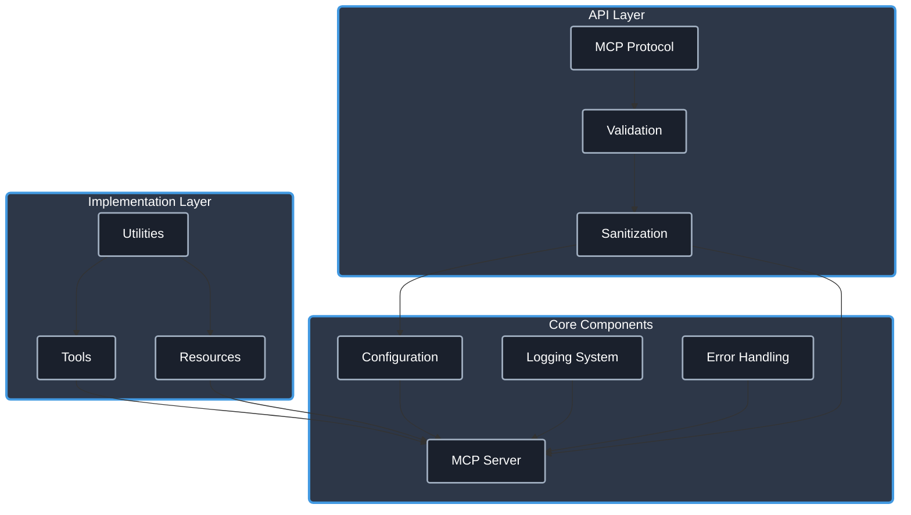

# Model Context Protocol Resources & Guides

[Guide Last Updated](https://img.shields.io/badge/Last%20Updated-April%202025-brightgreen.svg)

Welcome! This repository is a collection of guides, utilities, and server implementations for the **Model Context Protocol (MCP)** that I've created as I'm learning everything MCP has to offer. It reflects ongoing exploration and development with this powerful standard for enhancing Large Language Model (LLM) Agent capabilities. Questions and feedback are welcome! 🚀

## 📋 Table of Contents

- [Introduction to MCP](#-introduction-to-mcp)
- [MCP TypeScript Template](#-mcp-typescript-template-repo)
- [MCP Guides](#-mcp-guides)
- [MCP Utilities](#-mcp-utilities)
- [MCP Servers](#-mcp-servers)
  - [Perplexity](#perplexity-mcp-server)
  - [Atlas](#atlas-mcp-server)
  - [Filesystem](#filesystem-mcp-server)
  - [Toolkit](#toolkit-mcp-server)
  - [Mentor](#mentor-mcp-server)
  - [Obsidian](#obsidian-mcp-server)
  - [Git](#git-mcp-server)
  - [GitHub](#github-mcp-server)
  - [Ntfy](#ntfy-mcp-server)
- [Getting Started](#-getting-started)
- [License](#-license)

## 🔍 Introduction to MCP

The **Model Context Protocol (MCP)** is an open standard designed to standardize how AI applications (clients/hosts) connect to and interact with external data sources and tools (servers). Think of it like USB-C for AI: a universal way to plug capabilities into LLM applications.

**Key Benefits:**

- **Consistent Interface**: Standardized methods for LLMs to access tools and resources.
- **Enhanced Capabilities**: Empowers LLMs to interact with databases, APIs, local systems, and more.
- **Security & Control**: Provides structured access patterns with built-in validation and clear boundaries.
- **Extensibility**: Easily add new capabilities via servers without modifying core LLM applications.
- **Modularity**: Develop and maintain specialized functionalities in isolated, reusable server components.

For a more in-depth introduction to MCP, including its design philosophy and technical details, visit the official site: [modelcontextprotocol.io](https://modelcontextprotocol.io/).

## 🚀 [MCP TypeScript Template Repo](https://github.com/cyanheads/mcp-ts-template)

### ✨ The Ultimate Starter Kit for Building MCP Servers ✨

This **TypeScript template** provides a robust foundation for building production-ready Model Context Protocol (MCP) servers. It includes best practices, essential utilities, and a modular architecture suitable for beginners and experienced developers alike.

**Perfect for vibe code sessions**: Equip your LLM coding agent with this template to instantly understand the architecture and efficiently build new MCP servers.

**Key Features:**

- **Rock-solid Architecture**: Scalable and maintainable structure.
- **Production-ready Utilities**: Logging, error handling, ID generation, etc.
- **Type Safety**: Comprehensive TypeScript typing.
- **Security First**: Built-in protection against common vulnerabilities.
- **Working Examples**: Reference implementations of tools and resources.
- **Developer Cheat Sheet**: `.clinerules` file for LLM agent integration.

**Core Architecture:**

Click to expand architecture diagram

> Explore the [template repository](https://github.com/cyanheads/mcp-ts-template) for detailed documentation and usage instructions.

## 📚 MCP Guides

To help you get started building with MCP, here are comprehensive guides for both client and server development:

### [MCP Client Development Guide](guides/mcp-client-development-guide.md)

Learn how to build applications that consume MCP server capabilities. Covers:

- Core client architecture and components.
- Connection lifecycle management.
- Handling tools, resources, and prompts.
- Error handling and security best practices.
- Implementation examples (Python, TypeScript).
- Advanced topics: sampling, multi-server connections.

### [MCP Server Development Guide](guides/mcp-server-development-guide.md)

Learn how to create servers that provide capabilities to MCP clients. Covers:

- Core server architecture and principles.
- Step-by-step guide to building your first server.
- Exposing capabilities: Tools, Resources, Prompts.
- Advanced features: Sampling, Roots, Streaming, Progress, Subscriptions, Completions.
- Security best practices and implementation patterns.
- Troubleshooting common issues.
- Example server implementations.

## 🔧 MCP Utilities

Beyond the core guides, these utilities can assist in development and ecosystem interaction:

### [MCP Reporter](https://github.com/cyanheads/mcp-reporter)

Generates comprehensive reports detailing the capabilities of connected MCP servers. Useful for documentation, discovery, and integration.

- **Server Analysis**: Auto-discovery, capability extraction, progress monitoring.
- **Report Generation**: Structured Markdown, schema documentation, usage examples.
- **Integration**: CLI and programmatic API, configurable output.

## 🔌 MCP Servers

This repository hosts several example MCP server implementations, showcasing different capabilities:

### [Perplexity MCP Server](https://github.com/casey/perplexity-mcp-server)

Integrates with the [Perplexity AI API](https://docs.perplexity.ai/docs/getting-started) to provide search-augmented query capabilities to MCP clients. Built using the [mcp-ts-template](https://github.com/cyanheads/mcp-ts-template).

- **Perplexity Integration**: Search-augmented queries, recency/domain filtering, related questions, reasoning visibility (`showThinking`).
- **Core Utilities**: Secure logging, error handling, ID generation, rate limiting, input validation.
- **Type Safety**: Consistent interfaces via shared type definitions.
- **Security**: Input validation (`validator`), content sanitization (`sanitize-html`), parameter bounds enforcement.

> Requires a Perplexity API key (environment variable).
> Built on the mcp-ts-template foundation.

### [Atlas MCP Server](https://github.com/cyanheads/atlas-mcp-server)

ATLAS (Adaptive Task & Logic Automation System): A task and knowledge management system for LLM Agents, built on a Neo4j graph database and exposed via MCP.

- **Project Management**: Tracking, dependencies, bulk operations, URL management.
- **Task Management**: Lifecycle, prioritization, tagging, dependencies, assignments.
- **Knowledge Management**: Structured repository, linking, citations, search.
- **Graph Database**: Neo4j backend, ACID transactions, advanced search.
- **Unified Search**: Cross-entity search (Projects, Tasks, Knowledge) with filtering.

> **Version Note**: v2.0+ uses Neo4j (requires self-hosting or AuraDB). v1.5.4 was the last SQLite version. v2.5.0 introduced the Projects/Tasks/Knowledge structure.

### [Filesystem MCP Server](https://github.com/cyanheads/filesystem-mcp-server)

Provides secure and reliable tools for AI agents to interact with the local filesystem. Built using the [mcp-ts-template](https://github.com/cyanheads/mcp-ts-template).

- **File Operations**: Read, write, list, delete, move, copy files/directories.
- **Targeted Updates**: `update_file` tool for precise search/replace (text/regex).
- **Path Management**: Session-aware default working directory (`set_filesystem_default`).
- **Security**: Path sanitization, optional base directory restriction.
- **Robust Foundation**: Logging, error handling, ID generation, sanitization.

> Built on the mcp-ts-template foundation.
> Supports optional base directory restriction for enhanced security.

### [Toolkit MCP Server](https://github.com/cyanheads/toolkit-mcp-server)

Offers various system utilities and tools for LLM agents.

- **Network & System**: IP geolocation (cached), connectivity tests, ping, traceroute, public IP, system monitoring (load average, network interfaces).
- **Security & Generation**: Hashing (MD5, SHA), constant-time hash comparison, UUIDs, QR codes (terminal, SVG, Base64).
- **Time & Date**: Current time formatting, timezone conversion, IANA timezone listing.

> Optimized geolocation caching (ip-api.com).
> Uses Node.js native crypto module.

### [Mentor MCP Server](https://github.com/cyanheads/mentor-mcp-server)

Provides LLM agents with a "second opinion" using the Deepseek API (specifically Deepseek-Reasoning R1) for mentorship tasks.

- **Code Analysis**: Reviews, bug detection, style/best practices, performance, security.
- **Design & Architecture**: UI/UX critique, diagram analysis, pattern recommendations.
- **Content Enhancement**: Writing feedback, grammar/style, documentation review.
- **Strategic Planning**: Brainstorming, feasibility analysis, innovation suggestions.

> Powered by Deepseek-Reasoning (R1) via Deepseek API.
> Configurable timeouts, retries, token limits, rate limiting, caching.

### [Obsidian MCP Server](https://github.com/cyanheads/obsidian-mcp-server)

Enables LLMs to interact with [Obsidian](https://obsidian.md/) vaults via the Local REST API plugin.

- **Knowledge Management**: File CRUD, YAML frontmatter handling, content appending/patching, directory navigation.
- **Advanced Search**: Full-text search, JsonLogic queries, tag/property filtering, glob patterns.
- **Property Management**: YAML parsing/merging, auto-timestamps, custom fields, schemas.
- **Security & Performance**: API key auth, rate limiting, health checks, configurable limits.

> Requires the Obsidian Local REST API plugin.
> Secure vault access with validation.

### [Git MCP Server](https://github.com/cyanheads/git-mcp-server)

Provides tools for interacting with local Git repositories.

- **Repository**: Init, clone, status, browse content, config, history/logs.
- **Branches**: Create, list, checkout, delete, merge, compare, resolve conflicts.
- **Working Directory**: Stage, commit, diff, reset, blame, manage ignored files.
- **Remotes**: Add, list, fetch, pull, push, track upstream.
- **Advanced**: Tags, stash, cherry-pick, rebase (interactive), submodules.

> Exposes Git operations via MCP tools/resources with security boundaries.
> Standardized error handling and validation.

### [GitHub MCP Server](https://github.com/cyanheads/github-mcp-server)

Provides tools for interacting with the GitHub API.

- **Repositories**: Create, list, get info, configure settings.
- **Branches**: Create, delete, list, filter protected.
- **Issues**: Create, list, filter by state/labels.
- **Pull Requests**: Full lifecycle (create, update, merge - squash, rebase), list/filter.
- **Files**: Create/update content (Base64 support), commit messages.
- **Releases**: Create tagged releases (draft, prerelease).
- **Architecture**: Zod validation, rate limit handling, error categorization.

> Requires a GitHub Personal Access Token.
> Robust error handling and automatic rate limit management.

### [Ntfy MCP Server](https://github.com/cyanheads/ntfy-mcp-server)

Interacts with the [ntfy.sh](https://ntfy.sh/) push notification service.

- **Push Notifications**: Send to devices, priorities, emoji tags, titles, messages, click actions.
- **Advanced Features**: Action buttons (view, http, broadcast), attachments, delayed delivery, email forwarding, FCM integration.
- **Configuration**: Custom ntfy server URL, default topic, markdown, expiration, caching.
- **Integration**: Env var config, npm installable, MCP tool/resource interface.

> Easy setup with ntfy.sh (no account needed) or self-hosted instances.
> Standardized MCP integration.

## 🚀 Getting Started

1.  **Explore the Guides**: Understand MCP concepts and development approaches using the [Client](guides/mcp-client-development-guide.md) and [Server](guides/mcp-server-development-guide.md) guides.
2.  **Select a Server**: Choose one relevant to your needs from the [MCP Servers](#-mcp-servers) section and follow its specific setup instructions in its repository.
3.  **Connect a Client**: Use an existing MCP-compatible client (like Claude Desktop, Cline, etc.) or build your own using the [Client Development Guide](guides/mcp-client-development-guide.md).
4.  **Experiment & Contribute**: Try out the tools and consider contributing via issues or pull requests on the respective project repositories.

## 📄 License

This project and its components are licensed under the Apache License 2.0. See the [LICENSE](LICENSE) file for details, and check individual component repositories for any specific licensing nuances.

---

Created by <a href="https://github.com/cyanheads">cyanheads</a> with the Model Context Protocol

