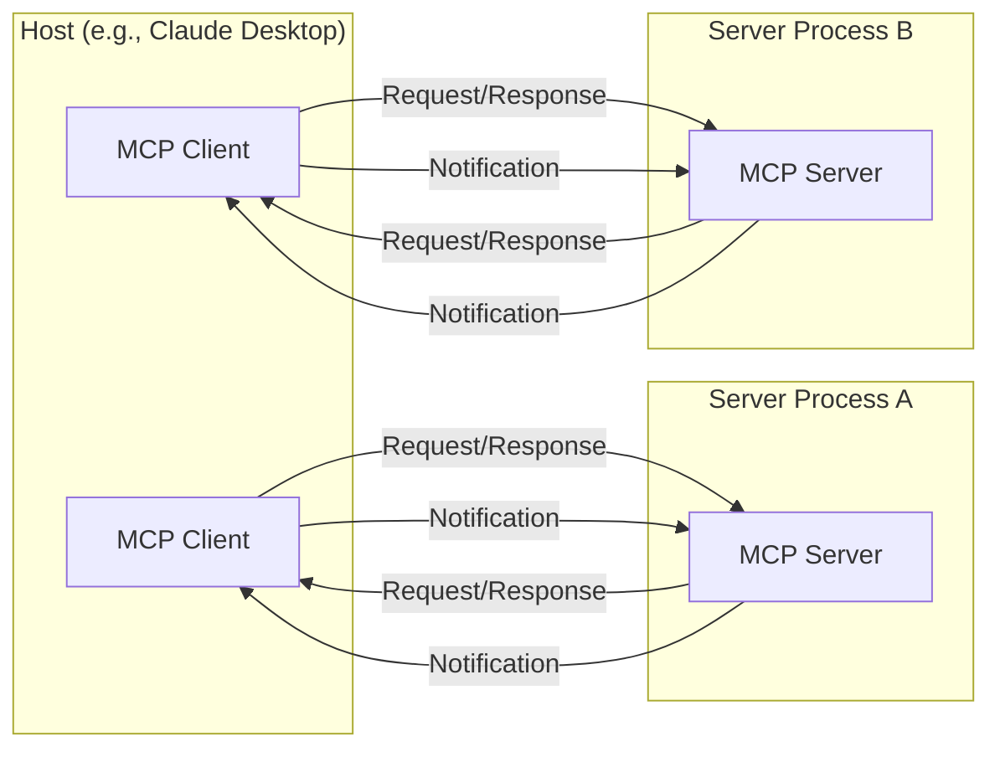
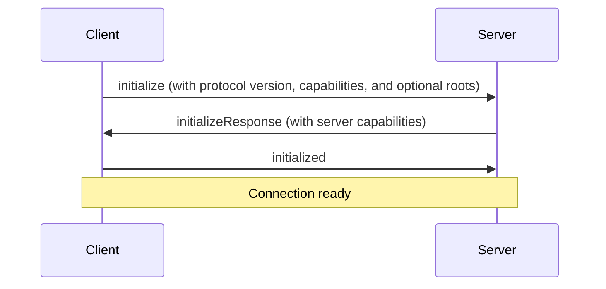

# MCP Client Development Guide: Building Robust and Flexible LLM Integrations

Welcome to the comprehensive MCP Client Development Guide. This documentation details how to build robust clients for the **Model Context Protocol (MCP)**, covering essential concepts, implementation patterns, and advanced features. Whether you're new to MCP or seeking to deepen your expertise, this guide provides practical examples and best practices for creating reliable LLM integrations.

## Table of Contents

1. [Introduction](#1-introduction)
    *   [Why MCP?](#why-mcp)
    *   [General Architecture](#general-architecture)
    *   [Get Started](#get-started)
2. [Core Architecture](#2-core-architecture)
    *   [Overview](#overview)
    *   [Core Components](#core-components)
    *   [Connection Lifecycle](#connection-lifecycle)
    *   [Error Handling](#error-handling)
3. [Lifecycle: Connection, Exchange, and Termination](#3-lifecycle-connection-exchange-and-termination)
    *   [Initialization](#initialization)
    *   [Message Exchange](#message-exchange)
    *   [Termination](#termination)
4. [Step-by-Step: Building an MCP Client](#4-step-by-step-building-an-mcp-client)
    *   [4.1. Installing the MCP SDK](#41-installing-the-mcp-sdk)
    *   [4.2. Connecting to a Server](#42-connecting-to-a-server)
    *   [4.3. Discovering Tools, Prompts, and Resources](#43-discovering-tools-prompts-and-resources)
    *   [4.4. Handling Tool Calls and Schema Validation](#44-handling-tool-calls-and-schema-validation)
    *   [4.5. Reading Resources](#45-reading-resources)
    *   [4.6. Using Prompts](#46-using-prompts)
    *   [4.7. Running Queries with LLM Integration and Context Re-injection](#47-running-queries-with-llm-integration-and-context-re-injection)
    *   [4.8. Human-in-the-Loop (Tool Call Approval)](#48-human-in-the-loop-tool-call-approval)
    *   [4.9. Example: Full Python Code](#49-example-full-python-code)
    *   [4.10. Example: Full TypeScript Code](#410-example-full-typescript-code)
5. [Advanced Topics](#5-advanced-topics)
    *   [5.1. Sampling](#51-sampling)
    *   [5.2. Multi-Server Connections](#52-multi-server-connections)
    *   [5.3. Multi-Step (Agentic) Flows](#53-multi-step-agentic-flows)
    *   [5.4. Resource Subscriptions](#54-resource-subscriptions)
    *   [5.5. Roots Feature](#55-roots-feature)
    *   [5.6. Progress / Partial Results](#56-progress--partial-results)
    *   [5.7. Multi-Server Aggregation](#57-multi-server-aggregation)
    *   [5.8. Tool Error Objects](#58-tool-error-objects)
    *   [5.9. Sampling from Server to Client](#59-sampling-from-server-to-client)
6. [Error Handling, Security, and Best Practices](#6-error-handling-security-and-best-practices)
    *   [6.1. Error Handling](#61-error-handling)
    *   [6.2. Security](#62-security)
    *   [6.3. Performance & Logging](#63-performance--logging)
    *   [6.4. Best Practices](#64-best-practices)
7. [Debugging and Next Steps](#7-debugging-and-next-steps)
    *   [7.1. Debugging Tools](#71-debugging-tools)
    *   [7.2. Debugging Tips](#72-debugging-tips)
    *   [7.3. Next Steps](#73-next-steps)
8. [Conclusion](#conclusion)

## 1. Introduction

The **Model Context Protocol (MCP)** is an open standard that defines how Large Language Model (LLM) applications access data, prompts, and tools. It acts as a universal connector, enabling your host application (an LLM-based chatbot, IDE, or any AI system) to communicate seamlessly with any MCP server.

**Analogy:** Just as USB-C unifies device connectivity, MCP unifies AI application integrations.

**Capabilities Gained Through MCP:**

*   **Tools:** Functionality like running shell commands, querying databases, or interacting with APIs.
*   **Resources:** Access to file contents, logs, or other data to provide context to the LLM. *Resources are application-controlled.*
*   **Prompts:** Predefined prompt templates or workflows to guide the LLM's behavior.
*   **Roots:** A way for clients to inform servers about relevant resources and their locations. *Roots are informational and help guide the server's operations.*

**Why Build an MCP Client?**

1. **Single Integration Point:** Add capabilities from any MCP server (filesystems, Git, Slack, or custom solutions) through a single, consistent protocol.
2. **LLM Independence:** Switch between LLM providers without altering your data integration strategy.
3. **Security & Human Control:** MCP incorporates built-in patterns for human approval and robust security checks, ensuring that tools and data are used responsibly. *Tool calls can be approved by the user before execution.*
4. **Extensibility:** Easily integrate new tools, data sources, and prompts by connecting to additional MCP servers.

## 2. Core Architecture

### Overview

MCP adopts a client-server architecture:

*   **Host:** The application that embeds the MCP client (e.g., Claude Desktop, an IDE, a custom chatbot).
*   **Client:** A component *within* the host that maintains a 1:1 connection with each MCP server.
*   **Server:** An independent process that provides context, tools, prompts, or other capabilities to the client.



### Core Components

#### Protocol Layer

*   Handles message framing, request-response linking, and communication using the JSON-RPC 2.0 standard.
*   **Python:** The `Session` class manages requests, notifications, and error handling.
*   **TypeScript:** The `Protocol` or `Client` classes provide hooks for request/notification handlers.

**TypeScript Example (Protocol Layer):**

```typescript
class Protocol<Request, Notification, Result> {
  // Handle incoming requests
  setRequestHandler<T>(schema: T, handler: (request: T, extra: any) => Promise<Result>): void {
    // Implementation for setting request handlers
  }

  // Handle incoming notifications
  setNotificationHandler<T>(schema: T, handler: (notification: T) => Promise<void>): void {
    // Implementation for setting notification handlers
  }

  // Send requests and await responses
  request<T>(request: Request, schema: T, options?: any): Promise<T> {
    // Implementation for sending requests
    return; // Placeholder
  }

  // Send one-way notifications
  notification(notification: Notification): Promise<void> {
    // Implementation for sending notifications
    return; // Placeholder
  }
}
```

**Python Example (Protocol Layer):**

```python
class Session(BaseSession[RequestT, NotificationT, ResultT]):
    async def send_request(self, request: RequestT, result_type: type[ResultT]) -> ResultT:
        """Send request and wait for response. Raises McpError if response contains error."""
        # Implementation for sending requests

    async def send_notification(self, notification: NotificationT) -> None:
        """Send one-way notification that doesn't expect response."""
        # Implementation for one-way notifications

    async def _received_request(self, responder) -> None:
        """Handle incoming request from other side."""
        # Handling an incoming request

    async def _received_notification(self, notification: NotificationT) -> None:
        """Handle incoming notification from other side."""
        # Handling an incoming notification
```

#### Transport Layer

Responsible for the underlying communication channel between client and server. Common options include:

1. **Stdio Transport:**
    *   Ideal for local processes.
    *   Uses standard input (stdin) and standard output (stdout).
2. **HTTP with SSE:**
    *   Suitable for remote connections or scenarios requiring one-way streaming (e.g., event updates).
    *   Uses HTTP POST for client-to-server and Server-Sent Events (SSE) for server-to-client communication.

**All communication uses JSON-RPC 2.0 to package requests, responses, and notifications.**

### Connection Lifecycle
The connection lifecycle consists of three phases: Initialization, Message Exchange, and Termination.

### Error Handling
MCP uses standard JSON-RPC 2.0 error codes for error handling.

## 3. Lifecycle: Connection, Exchange, and Termination

### Initialization

1. **Client** sends `initialize` request to **Server**, including protocol version and client capabilities. Also, the client can provide a list of suggested roots to the server using the `roots` parameter.
2. **Server** responds with its `initialize` response, including its capabilities.
3. **Client** sends `initialized` notification to confirm the handshake.



### Message Exchange

*   **Requests:** Expect a response from the other party.
*   **Notifications:** One-way messages that do not expect a response.
*   Both client and server can initiate requests.

### Termination

*   Either side can initiate a graceful close using `close()`.
*   Connections might also terminate due to transport errors (e.g., network issues).
*   Clients should handle cleanup, confirm the delivery of final messages, and manage error codes. They should also implement reconnection logic where appropriate.

## 4. Step-by-Step: Building an MCP Client

This section provides a practical guide to building and running an MCP client that can:

1. Connect to an MCP server via stdio.
2. Discover prompts, resources, and tools.
3. Send queries to an LLM (e.g., Claude) and orchestrate tool usage based on the LLM's response.
4. Handle user input and display responses.
5. Re-inject context after tool calls to maintain conversation flow.

### 4.1. Installing the MCP SDK

**Python:**

```bash
pip install mcp
```

**TypeScript:**

```bash
npm install @modelcontextprotocol/sdk
```

### 4.2. Connecting to a Server

**Python (Stdio Example):**

```python
import asyncio
from mcp import ClientSession, StdioServerParameters
from mcp.client.stdio import stdio_client

async def connect_to_server(script_path: str):
    params = StdioServerParameters(command="python", args=[script_path])
    try:
        async with stdio_client(params) as streams:
            async with ClientSession(streams[0], streams[1]) as session:
                # Initialize the session and declare roots
                await session.initialize(
                    roots=[
                        {"uri": "file:///path/to/project", "name": "My Project"},
                        {
                            "uri": "https://api.example.com/v1",
                            "name": "Example API",
                        },
                    ]
                )
                print("Successfully connected to the server.")
                return session
    except Exception as e:
        print(f"Failed to connect to the server: {e}")
        return None
```

**TypeScript (Stdio Example):**

```typescript
import { Client } from "@modelcontextprotocol/sdk/client/index.js";
import { StdioClientTransport } from "@modelcontextprotocol/sdk/client/stdio.js";

async function connectToServer(command: string, args: string[]) {
  const client = new Client({ name: "my-client", version: "1.0.0" }, {});
  const transport = new StdioClientTransport({ command, args });
  try {
    await client.connect(transport);
    // Initialize the client and declare roots
    await client.initialize({
      roots: [
        { uri: "file:///path/to/project", name: "My Project" },
        { uri: "https://api.example.com/v1", name: "Example API" },
      ],
    });
    console.log("Successfully connected to the server.");
    return client;
  } catch (error) {
    console.error("Failed to connect to the server:", error);
    return null;
  }
}
```

### 4.3. Discovering Tools, Prompts, and Resources

After initialization, query the server for its capabilities:

**Python:**

```python
async def discover_capabilities(session: ClientSession):
    try:
        tools_response = await session.list_tools()
        print("Tools:", [t.name for t in tools_response.tools])

        prompts_response = await session.list_prompts()
        print("Prompts:", [p.name for p in prompts_response.prompts])

        resources_response = await session.list_resources()
        for res in resources_response.resources:
            print("Resource:", res.uri, res.name)
    except Exception as e:
        print(f"Error during discovery: {e}")
```

**TypeScript:**

```typescript
async function discoverCapabilities(client: Client) {
  try {
    const tools = await client.listTools();
    console.log("Tools:", tools.tools.map((t) => t.name));

    const prompts = await client.listPrompts();
    console.log("Prompts:", prompts.prompts.map((p) => p.name));

    const resources = await client.listResources();
    resources.resources.forEach((r) => console.log("Resource:", r.uri, r.name));
  } catch (error) {
    console.error("Error during discovery:", error);
  }
}
```

### 4.4. Handling Tool Calls and Schema Validation

**Calling a Tool:**

**Python:**

```python
async def call_tool_example(session: ClientSession):
    try:
        result = await session.call_tool(
            name="calculate_sum", arguments={"a": 2, "b": 3}
        )
        if result.isError:
            print(f"Tool call error: {result.content[0].text}")
        else:
            print("Sum result:", result.content[0].text)
    except Exception as e:
        print(f"Error calling tool: {e}")
```

**TypeScript:**

```typescript
async function callToolExample(client: Client) {
  try {
    const toolResult = await client.callTool("calculate_sum", { a: 2, b: 3 });
    if (toolResult.isError) {
      console.error("Tool call error:", toolResult.content[0].text);
    } else {
      console.log("Tool result:", toolResult.content[0].text);
    }
  } catch (error) {
    console.error("Error calling tool:", error);
  }
}
```

**Schema Validation:**

Validate tool arguments against the `inputSchema` provided by the server using libraries like `zod` (TypeScript) or `pydantic` (Python).

**Python (using `pydantic`):**

```python
from pydantic import BaseModel, ValidationError

async def validate_and_call_tool(session: ClientSession, tool_name: str, tool_args: dict):
    tools_response = await session.list_tools()
    for tool in tools_response.tools:
        if tool.name == tool_name:
            try:
                # Dynamically create a Pydantic model from the input schema
                class ToolArgs(BaseModel):
                    pass
                ToolArgs = create_model_from_schema(tool.inputSchema)

                # Validate arguments
                validated_args = ToolArgs(**tool_args)

                # Call the tool with validated arguments
                result = await session.call_tool(
                    name=tool.name, arguments=validated_args.model_dump()
                )
                if result.isError:
                    print(f"Tool call error: {result.content[0].text}")
                else:
                    print(f"Result of {tool.name}:", result.content[0].text)

            except ValidationError as e:
                print(f"Invalid arguments for {tool.name}:", e)
            except Exception as e:
                print(f"Error calling tool {tool_name}: {e}")
            return

    print(f"Tool not found: {tool_name}")

def create_model_from_schema(schema: dict):
    """Helper function to create a Pydantic model from a JSON schema."""
    fields = {}
    for name, prop in schema.get("properties", {}).items():
        field_type = get_type_for_prop(prop)
        if "required" in schema and name in schema["required"]:
            fields[name] = (field_type, ...)
        else:
            fields[name] = (field_type, None)
    return type("ToolArgs", (BaseModel,), {"__annotations__": fields})

def get_type_for_prop(prop: dict):
    """Helper function to map JSON schema types to Python types."""
    prop_type = prop.get("type")
    if prop_type == "integer":
        return int
    elif prop_type == "number":
        return float
    elif prop_type == "string":
        return str
    elif prop_type == "boolean":
        return bool
    elif prop_type == "array":
        items_type = get_type_for_prop(prop.get("items", {}))
        return list[items_type]
    elif prop_type == "object":
        return dict
    else:
        return None
```

**TypeScript (using `zod`):**

```typescript
import { z } from "zod";

async function validateAndCallTool(client: Client, toolName: string, toolArgs: any) {
  const tools = await client.listTools();
  const tool = tools.tools.find((t) => t.name === toolName);

  if (tool) {
    try {
      // Create a Zod schema from the input schema
      const toolSchema = createZodSchema(tool.inputSchema);

      // Validate arguments
      const validatedArgs = toolSchema.parse(toolArgs);

      // Call the tool with validated arguments
      const toolResult = await client.callTool(tool.name, validatedArgs);
      if (toolResult.isError) {
        console.error("Tool call error:", toolResult.content[0].text);
      } else {
        console.log(`Tool result: ${toolResult.content[0].text}`);
      }
    } catch (error) {
      if (error instanceof z.ZodError) {
        console.error("Invalid arguments:", error.errors);
      } else {
        console.error(`Error calling tool ${toolName}:`, error);
      }
    }
  } else {
    console.error(`Tool not found: ${toolName}`);
  }
}

function createZodSchema(schema: any): z.ZodTypeAny {
  // Helper function to map JSON schema types to Zod types
  const type = schema.type;

  if (type === "string") {
    return z.string();
  } else if (type === "number") {
    return z.number();
  } else if (type === "integer") {
    return z.number().int();
  } else if (type === "boolean") {
    return z.boolean();
  } else if (type === "array") {
    const items = schema.items || {};
    return z.array(createZodSchema(items));
  } else if (type === "object") {
    const properties = schema.properties || {};
    const shape: Record<string, z.ZodTypeAny> = {};
    for (const [key, value] of Object.entries(properties)) {
      shape[key] = createZodSchema(value);
    }
    return z.object(shape);
  } else {
    return z.any();
  }
}
```

### 4.5. Reading Resources

**Python:**

```python
async def read_resource_example(session: ClientSession):
    try:
        resources = await session.list_resources()
        res = next(
            (
                r
                for r in resources.resources
                if r.uri == "file:///path/to/app.log"
            ),
            None,
        )

        if res:
            contents = await session.read_resource(res.uri)
            print(contents.contents[0].text)  # The file's text
        else:
            print("Resource not found.")
    except Exception as e:
        print(f"Error reading resource: {e}")
```

**TypeScript:**

```typescript
async function readResourceExample(client: Client) {
  try {
    const resources = await client.listResources();
    const res = resources.resources.find(
      (r) => r.uri === "file:///path/to/app.log"
    );

    if (res) {
      const contents = await client.readResource(res.uri);
      console.log(contents.contents[0].text); // The file's text
    } else {
      console.error("Resource not found.");
    }
  } catch (error) {
    console.error("Error reading resource:", error);
  }
}
```

### 4.6. Using Prompts

**Python:**

```python
async def get_prompt_example(session: ClientSession):
    try:
        prompts = await session.list_prompts()
        prompt = next(
            (p for p in prompts.prompts if p.name == "prompt-name"), None
        )

        if prompt:
            prompt_result = await session.get_prompt(prompt.name)
            print("Prompt messages:", prompt_result.messages)
        else:
            print("Prompt not found.")
    except Exception as e:
        print(f"Error getting prompt: {e}")
```

**TypeScript:**

```typescript
async function getPromptExample(client: Client) {
  try {
    const prompts = await client.listPrompts();
    const prompt = prompts.prompts.find((p) => p.name === "prompt-name");

    if (prompt) {
      const promptResult = await client.getPrompt(prompt.name);
      console.log("Prompt messages:", promptResult.messages);
    } else {
      console.error("Prompt not found.");
    }
  } catch (error) {
    console.error("Error getting prompt:", error);
  }
}
```

### 4.7. Running Queries with LLM Integration and Context Re-injection

MCP standardizes server communication but doesn't mandate a specific LLM. Integrate with Claude (Anthropic), OpenAI, or other LLMs using their respective client libraries.

**Key Idea: Context Re-injection**

After each tool call, you typically want to re-inject the previous conversation history, along with the tool's results, back into the LLM's context. This allows the LLM to maintain awareness of the ongoing interaction and make informed decisions about subsequent steps.

**Simplified Python Example (using Anthropic's client):**

```python
from anthropic import Anthropic, types

anthropic_client = Anthropic()

async def process_user_query(session: ClientSession, user_input: str):
    messages = [{"role": "user", "content": user_input}]

    try:
        # 1) Possibly discover tools
        tools_info = await session.list_tools()

        # 2) Send query + tool list to LLM
        llm_response = anthropic_client.messages.create(
            model="claude-3-opus-20240229",
            max_tokens=1000,
            messages=messages,
            tools=[
                {
                    "name": t.name,
                    "description": t.description,
                    "input_schema": t.inputSchema,
                }
                for t in tools_info.tools
            ],
        )

        # 3) Handle LLM response and potential tool calls
        final_response = ""

        for content in llm_response.content:
            if content.type == "text":
                final_response += content.text
            elif content.type == "tool_use":
                # 3a) Optionally, get user approval here
                if await should_call_tool(
                    session, content.name, content.input
                ):
                    # 3b) Execute the tool call
                    tool_result = await session.call_tool(
                        name=content.name, arguments=content.input
                    )

                    # 3c) Re-inject context and tool result into the messages
                    messages.append(
                        types.MessageParam(
                            role="assistant",
                            content=[content],
                        )
                    )
                    messages.append(
                        types.MessageParam(
                            role="user",
                            content=tool_result.content,
                        )
                    )

                    # 3d) Send updated messages back to the LLM
                    llm_response = anthropic_client.messages.create(
                        model="claude-3-opus-20240229",
                        max_tokens=1000,
                        messages=messages,
                    )

                    for content in llm_response.content:
                        if content.type == "text":
                            final_response += content.text

        # 4) Return the final result to the user
        return final_response
    except Exception as e:
        print(f"Error processing user query: {e}")
        return "An error occurred while processing your request."
```

**Explanation:**

1. The `messages` list maintains the conversation history.
2. After a tool call, the tool use request and the tool result are appended to `messages`.
3. The updated `messages` are sent back to the LLM, providing it with the complete context of the interaction so far.

### 4.8. Human-in-the-Loop (Tool Call Approval)

MCP emphasizes human oversight. Before executing a tool, you can prompt the user for confirmation:

**Python (Example):**

```python
async def should_call_tool(
    session: ClientSession, tool_name: str, tool_args: dict
):
    """
    Prompts the user to approve a tool call and returns True if approved, False otherwise.
    """
    print(f"LLM requested to call tool: {tool_name}")
    print(f"Arguments: {tool_args}")

    # In a real application, you might want to use a more sophisticated method
    # to get user input, e.g., a GUI prompt.
    response = input("Approve tool execution? (y/n): ").lower()
    return response == "y"
```

**TypeScript (Example):**

```typescript
async function shouldCallTool(
  client: Client,
  toolName: string,
  toolArgs: any
) {
  /**
   * Prompts the user to approve a tool call and returns True if approved, False otherwise.
   */
  console.log(`LLM requested to call tool: ${toolName}`);
  console.log(`Arguments: ${JSON.stringify(toolArgs)}`);

  const rl = readline.createInterface({
    input: process.stdin,
    output: process.stdout,
  });

  const answer = await new Promise<string>((resolve) => {
    rl.question("Approve tool execution? (y/n): ", resolve);
  });

  rl.close();

  return answer.toLowerCase() === "y";
}
```

### 4.9. Example: Full Python Code

```python
import asyncio
import sys
from typing import Optional
from contextlib import AsyncExitStack

from mcp import ClientSession, StdioServerParameters
from mcp.client.stdio import stdio_client

from anthropic import Anthropic, types
from dotenv import load_dotenv
from pydantic import BaseModel, ValidationError

load_dotenv()

class MCPClient:
    def __init__(self):
        self.session: Optional[ClientSession] = None
        self.exit_stack = AsyncExitStack()
        self.anthropic = Anthropic()

    async def connect_to_server(self, server_script_path: str):
        command = "python" if server_script_path.endswith(".py") else "node"
        params = StdioServerParameters(command=command, args=[server_script_path])

        stdio_transport = await self.exit_stack.enter_async_context(stdio_client(params))
        self.stdio, self.write = stdio_transport
        self.session = await self.exit_stack.enter_async_context(ClientSession(self.stdio, self.write))

        await self.session.initialize()

    async def chat_loop(self):
        print("MCP Client ready. Type a query or 'quit'.")
        while True:
            user_input = input("Query: ").strip()
            if user_input.lower() == "quit":
                break

            response = await self.handle_llm_query(user_input)
            print("Response:\n", response)

    async def handle_llm_query(self, query: str) -> str:
        messages = [{"role": "user", "content": query}]
        # Potentially list server tools
        tool_list = await self.session.list_tools()

        # Send query to LLM (Anthropic example)
        claude_response = self.anthropic.messages.create(
            model="claude-3-opus-20240229",
            max_tokens=1000,
            messages=messages,
            tools=[
                {
                    "name": t.name,
                    "description": t.description,
                    "input_schema": t.inputSchema,
                }
                for t in tool_list.tools
            ],
        )

        final_text = ""
        for content in claude_response.content:
            if content.type == "text":
                final_text += content.text
            elif content.type == "tool_use":
                # Human-in-the-loop approval before tool execution
                if await should_call_tool(
                    self.session, content.name, content.input
                ):
                    # Execute a tool call
                    result = await self.session.call_tool(content.name, content.input)
                    if result.isError:
                        final_text += f"\n[TOOL CALL ERROR] {result.content[0].text}"
                    else:
                        final_text += "\n[TOOL CALL RESULT] " + str(result.content[0].text)

                    messages.append(
                        types.MessageParam(
                            role="assistant",
                            content=[content],
                        )
                    )

                    messages.append(
                        types.MessageParam(
                            role="user",
                            content=result.content,
                        )
                    )

                    claude_response = self.anthropic.messages.create(
                        model="claude-3-opus-20240229",
                        max_tokens=1000,
                        messages=messages,
                    )

                    for content in claude_response.content:
                        if content.type == "text":
                            final_text += content.text
                else:
                    final_text += f"\nTool '{content.name}' execution was not approved."

        return final_text

    async def cleanup(self):
        await self.exit_stack.aclose()

async def should_call_tool(
    session: ClientSession, tool_name: str, tool_args: dict
):
    """
    Prompts the user to approve a tool call and returns True if approved, False otherwise.
    """
    print(f"LLM requested to call tool: {tool_name}")
    print(f"Arguments: {tool_args}")

    # In a real application, you might want to use a more sophisticated method
    # to get user input, e.g., a GUI prompt.
    response = input("Approve tool execution? (y/n): ").lower()
    return response == "y"

async def main():
    if len(sys.argv) < 2:
        print("Usage: python client.py <server.py>")
        sys.exit(1)
    client = MCPClient()
    try:
        await client.connect_to_server(sys.argv[1])
        await client.chat_loop()
    finally:
        await client.cleanup()

if __name__ == "__main__":
    asyncio.run(main())
```

### 4.10. Example: Full TypeScript Code

```typescript
import { Client } from "@modelcontextprotocol/sdk/client/index.js";
import { StdioClientTransport } from "@modelcontextprotocol/sdk/client/stdio.js";
import { Anthropic } from "@anthropic-ai/sdk";
import * as readline from "readline";
import { z } from "zod";

async function main() {
  if (process.argv.length < 3) {
    console.error("Usage: node client.js <server-script>");
    process.exit(1);
  }
  const serverScript = process.argv[2];

  // Setup client & transport
  const client = new Client({ name: "my-ts-client", version: "1.0.0" }, {});
  const transport = new StdioClientTransport({
    command: serverScript.endsWith(".ts") ? "npx" : "node",
    args: serverScript.endsWith(".ts")
      ? ["ts-node", serverScript]
      : [serverScript],
  });
  await client.connect(transport);
  await client.initialize();

  // List available tools
  const tools = await client.listTools();
  console.log("Tools available:", tools.tools.map((t) => t.name));

  const anthropic = new Anthropic({
    apiKey: process.env.ANTHROPIC_API_KEY || "",
  });

  // Simple REPL
  const rl = readline.createInterface({
    input: process.stdin,
    output: process.stdout,
  });
  console.log("Type your queries or 'quit' to exit.\n");

  for await (const line of rl) {
    const query = line.trim();
    if (!query || query.toLowerCase() === "quit") {
      break;
    }

    let messages = [{ role: "user", content: query }];

    // Send query to LLM (Anthropic example)
    let claudeResponse = await anthropic.messages.create({
      model: "claude-3-opus-20240229",
      max_tokens: 1000,
      messages: messages,
      tools: tools.tools.map((t) => ({
        name: t.name,
        description: t.description,
        input_schema: t.inputSchema,
      })),
    });

    console.log("LLM response:", claudeResponse);

    // Check if LLM wants to call a tool
    for (const content of claudeResponse.content) {
      if (content.type === "tool_use") {
        // Human-in-the-loop approval
        if (
          await shouldCallTool(client, content.name, content.input)
        ) {
          // Execute a tool call
          const result = await client.callTool(content.name, content.input);
          console.log("Tool Result:", result);

          messages.push({
            role: "assistant",
            content: [content],
          });

          messages.push({
            role: "user",
            content: result.content,
          });

          claudeResponse = await anthropic.messages.create({
            model: "claude-3-opus-20240229",
            max_tokens: 1000,
            messages: messages,
          });
          console.log("LLM response:", claudeResponse);
        } else {
          console.log(
            `Tool call to ${content.name} was not approved.`
          );
        }
      }
    }
  }

  rl.close();
  console.log("Shutting down MCP client...");
  // End
}

async function shouldCallTool(
  client: Client,
  toolName: string,
  toolArgs: any
) {
  /**
   * Prompts the user to approve a tool call and returns True if approved, False otherwise.
   */
  console.log(`LLM requested to call tool: ${toolName}`);
  console.log(`Arguments: ${JSON.stringify(toolArgs)}`);

  const rl = readline.createInterface({
    input: process.stdin,
    output: process.stdout,
  });

  const answer = await new Promise<string>((resolve) => {
    rl.question("Approve tool execution? (y/n): ", resolve);
  });

  rl.close();

  return answer.toLowerCase() === "y";
}

main().catch((err) => {
  console.error("Fatal error:", err);
  process.exit(1);
});
```

## 5. Advanced Topics

### 5.1. Sampling

**Sampling** allows servers to request completions from the LLM through the client. The client can:

*   Prompt the user for approval before making the LLM call.
*   Manage costs associated with LLM usage.
*   Filter or modify the LLM's response before returning it to the server.

**Typical Flow:**

1. **Server** sends a `sampling/createMessage` request to the **Client**.
2. **Client** calls the LLM, potentially after user approval or modification of the request.
3. **Client** returns the LLM's response to the **Server**.

**Example `sampling/createMessage` Request:**

```json
{
  "method": "sampling/createMessage",
  "params": {
    "messages": [
      {
        "role": "user",
        "content": {
          "type": "text",
          "text": "What files are in the current directory?"
        }
      }
    ],
    "systemPrompt": "You are a helpful file system assistant.",
    "includeContext": "thisServer",
    "maxTokens": 100,
    "modelPreferences": {
      "hints": [{ "name": "claude-3" }, { "name": "gpt-4" }],
      "costPriority": 0.8,
      "speedPriority": 0.5,
      "intelligencePriority": 0.7
    }
  }
}
```

**Model Preferences:**

*   `hints`: An ordered array of model name suggestions (e.g., "claude-3", "gpt-4"). Clients can map these to equivalent models from different providers.
*   `costPriority`: Importance of minimizing cost (0.0 to 1.0).
*   `speedPriority`: Importance of low latency (0.0 to 1.0).
*   `intelligencePriority`: Importance of model capabilities (0.0 to 1.0).

### 5.2. Multi-Server Connections

A single MCP client can manage connections to multiple servers simultaneously. Each server might offer different tools, resources, or prompts.

**Benefits:**

*   **Expanded Capabilities:** The LLM can choose from a wider range of tools and data sources.
*   **Modularity:** Servers can be developed and maintained independently.
*   **Flexibility:** The client can dynamically connect to different servers based on the task or context.

**Example Scenario:**

*   **Server A:** Provides filesystem access.
*   **Server B:** Offers a database interface.
*   **Server C:** Handles interactions with a specific API (e.g., GitHub, Slack).

The client aggregates the capabilities of all connected servers, presenting a unified set of tools and resources to the LLM.

### 5.3. Multi-Step (Agentic) Flows

MCP enables the creation of complex, multi-step workflows, often referred to as "agentic" flows:

1. **LLM** receives a user request.
2. **LLM** decides to use a tool provided by an MCP server (e.g., to fetch data).
3. **Client** executes the tool call (potentially after user approval).
4. **Server** returns the tool's result to the **Client**.
5. **Client** provides the result to the **LLM**.
6. **LLM** processes the result and might decide to call another tool, read a resource, or generate a response for the user.

This iterative process can continue for multiple steps, allowing the LLM to perform complex tasks that involve interactions with multiple tools and data sources.

**Human-in-the-Loop:** Human oversight can be incorporated at any stage of the flow. The client can prompt the user to approve tool calls, review intermediate results, or provide additional input.

### 5.4. Resource Subscriptions

Clients can subscribe to resource updates using `resources/subscribe` and receive notifications via `notifications/resources/updated` when the resource changes. Clients can then read the updated resource content using `resources/read`. To unsubscribe, clients can use `resources/unsubscribe`.

**Example Scenario:** Streaming log files, live data feeds.

### 5.5. Roots Feature

Roots are a way for clients to inform servers about relevant resources and their locations (e.g., project directories, API endpoints). Roots are declared during the `initialize` request.

**Example `initialize` request with roots:**

```json
{
  "method": "initialize",
  "params": {
    "capabilities": {
      "roots": {}
    },
    "roots": [
      {
        "uri": "file:///home/user/projects/my-project",
        "name": "My Project"
      },
      {
        "uri": "https://api.example.com/v1",
        "name": "Example API"
      }
    ]
  }
}
```

Servers should respect the provided roots, but roots are informational and not strictly enforced.

### 5.6. Progress / Partial Results

Servers can provide partial results or progress updates for long-running tool calls using progress tokens.

**Example Scenario:** A tool that performs a lengthy data analysis task and provides intermediate results.

### 5.7. Multi-Server Aggregation

Clients can manage a single conversation context spanning multiple servers.

**Example Flow:**

1. Connect to multiple servers.
2. Aggregate tools from different servers.
3. Send a query to the LLM, including tools from multiple servers.
4. Handle tool calls to different servers.
5. Maintain a unified conversation history and feed it back to the LLM.

**Strategies for handling naming conflicts:**

*   Prefix tool names with the server name.

### 5.8. Tool Error Objects

Servers can use the `isError` flag in tool results to indicate tool-level errors.

**Example (Python):**

```python
try:
    # Tool operation
    result = perform_operation()
    return types.CallToolResult(
        content=[
            types.TextContent(
                type="text",
                text=f"Operation successful: {result}"
            )
        ]
    )
except Exception as error:
    return types.CallToolResult(
        isError=True,  # Indicate a tool error
        content=[
            types.TextContent(
                type="text",
                text=f"Error: {str(error)}"
            )
        ]
    )
```

### 5.9. Sampling from Server to Client

Servers can request completions from the LLM through the client using `sampling/createMessage`.

**Example Flow:**

1. Server sends `sampling/createMessage` request to the Client.
2. Client prompts user for approval (optional).
3. Client modifies the request (optional).
4. Client calls the LLM.
5. Client filters or modifies the completion (optional).
6. Client returns the result to the Server.

**Example `sampling/createMessage` request:**

```json
{
  "method": "sampling/createMessage",
  "params": {
    "messages": [
      {
        "role": "user",
        "content": {
          "type": "text",
          "text": "Summarize this document."
        }
      }
    ],
    "systemPrompt": "You are a helpful summarization assistant.",
    "includeContext": "thisServer",
    "maxTokens": 200,
    "modelPreferences": {
      "hints": [{ "name": "claude-3" }],
      "costPriority": 0.2,
      "speedPriority": 0.8,
      "intelligencePriority": 0.9
    }
  }
}
```

**Human-in-the-loop aspects:**

*   Clients should show users the proposed prompt.
*   Users should be able to modify or reject prompts.
*   Clients can filter or modify completions.
*   Users control which model is used.

## 6. Error Handling, Security, and Best Practices

### 6.1. Error Handling

*   **JSON-RPC Error Codes:** MCP uses standard JSON-RPC 2.0 error codes:
    *   `ParseError` (-32700): Invalid JSON was received.
    *   `InvalidRequest` (-32600): The JSON sent is not a valid request object.
    *   `MethodNotFound` (-32601): The method does not exist or is not available.
    *   `InvalidParams` (-32602): Invalid method parameters.
    *   `InternalError` (-32603): Internal JSON-RPC error.
*   **Tool Errors:** Tools should not raise protocol-level errors for logic issues. Instead, they should return a result object with `isError: true` and include error details in the `content` field.
*   **Graceful Degradation:** Clients should handle transport errors (e.g., server disconnects, timeouts) gracefully. Implement reconnection logic where appropriate.

**Example: Handling JSON-RPC Errors (Python):**

```python
from mcp import McpError

async def handle_request(session: ClientSession, request):
    try:
        # Process the request
        response = await process_request(request)
        return response
    except McpError as e:
        if e.code == -32601:
            print(f"Method not found: {e.message}")
            # Handle method not found error
        elif e.code == -32602:
            print(f"Invalid parameters: {e.message}")
            # Handle invalid parameters error
        else:
            print(f"An error occurred: {e.message}")
            # Handle other errors
    except Exception as e:
        print(f"Unexpected error: {e}")
        # Handle unexpected errors
```

### 6.2. Security

1. **Transport Security:**
    *   Use TLS when connecting to remote servers over a network.
    *   Validate the server's identity to prevent man-in-the-middle attacks.
2. **Tool/Resource Access:**
    *   **Principle of Least Privilege:** Servers should only expose the minimum necessary tools and resources.
    *   **User Approval:** Obtain user confirmation before executing potentially destructive or sensitive tool calls.
    *   **Rate Limiting:** Implement rate limiting to prevent abuse and control resource usage.
3. **Prompt Injection:**
    *   Be aware that malicious prompts could trick the LLM into calling unauthorized tools or revealing sensitive information.
    *   Log and monitor prompt usage for suspicious patterns.
    *   Consider using a separate, restricted LLM for tool selection and execution.
    *   Implement strict input sanitization.
4. **Input Validation:**
    *   Validate *all* inputs received from servers (tool arguments, resource content, prompt data) against their respective schemas.
    *   Sanitize inputs to prevent injection attacks.
    *   Use schema validation libraries like `zod` (TypeScript) or `pydantic` (Python).

**Example: Input Validation with Pydantic (Python):**

```python
from pydantic import BaseModel, validator

class ToolArgs(BaseModel):
    filepath: str
    operation: str

    @validator("filepath")
    def filepath_must_be_safe(cls, v):
        if ".." in v or v.startswith("/"):
            raise ValueError("Invalid filepath")
        return v

    @validator("operation")
    def operation_must_be_allowed(cls, v):
        allowed_operations = ["read", "write"]
        if v not in allowed_operations:
            raise ValueError("Invalid operation")
        return v
```

### 6.3. Performance & Logging

*   **Logging:** Log all MCP requests, responses, and errors to aid in debugging and monitoring. Differentiate between protocol-level events and application-level events. Use structured logging to make logs easier to parse and analyze.
*   **Timeouts:** Implement timeouts for tool calls and other long-running operations to prevent the client from hanging indefinitely.
*   **Concurrency:** If handling multiple requests concurrently, use appropriate synchronization mechanisms (e.g., locks, queues) to avoid race conditions. Consider limiting the number of simultaneous requests to prevent resource exhaustion.
*   **Resource Management:** Ensure that resources (e.g., file handles, network connections) are properly released when no longer needed. Use context managers (e.g., `async with`) to ensure proper cleanup.

**Example: Logging (Python):**

```python
import logging

logging.basicConfig(level=logging.INFO)

async def handle_request(session: ClientSession, request):
    logging.info(f"Received request: {request.method}")
    try:
        response = await process_request(request)
        logging.info(f"Sending response: {response}")
        return response
    except Exception as e:
        logging.error(f"Error processing request: {e}")
        # Handle error
```

### 6.4. Best Practices

*   **Schema Validation:** Use schema validation (e.g., `zod` in TypeScript, `pydantic` in Python) to ensure that tool arguments and other data structures conform to the expected format.
*   **Modular Design:** Keep your MCP client code separate from your LLM interaction logic. This improves maintainability and allows you to reuse your client with different LLMs or applications.
*   **Asynchronous Operations:** Utilize asynchronous programming (e.g., `asyncio` in Python, `async/await` in TypeScript) to avoid blocking the main thread during network operations or long tool calls.
*   **Error Handling:** Implement comprehensive error handling to gracefully manage unexpected situations and provide informative feedback to the user or LLM.
*   **Testing:** Thoroughly test your client implementation, including edge cases, error scenarios, and interactions with different types of servers.

## 7. Debugging and Next Steps

### 7.1. Debugging Tools

*   **MCP Inspector:** A command-line tool for interactively connecting to MCP servers, sending requests, and inspecting responses. This is invaluable for testing and debugging both clients and servers.
*   **Claude Desktop Developer Tools:** If you're building a client integrated with Claude Desktop, you can access logs in `~/Library/Logs/Claude/` (macOS) and use Chrome DevTools for debugging the application.

### 7.2. Debugging Tips

*   **Enable Verbose Logging:** Configure your client and server to log detailed information about requests, responses, and internal state.
*   **Isolate the Problem:** Determine whether the issue lies in the client, the server, or the communication between them. Use the MCP Inspector to test the server independently.
*   **Inspect Messages:** Carefully examine the JSON-RPC messages exchanged between the client and server. Look for invalid formats, missing fields, or incorrect values. Use a network monitoring tool (e.g., Wireshark, tcpdump) to inspect raw messages if necessary.
*   **Test with Simple Cases:** Start with basic scenarios (e.g., listing tools, calling a simple tool) before moving on to more complex interactions.
*   **Check for Errors:** Pay close attention to error messages and codes. They often provide valuable clues about the nature of the problem.

### 7.3. Next Steps

*   **Explore Example Servers:** The MCP documentation provides links to various example servers (e.g., filesystem, Git, Slack) that you can use for testing and inspiration.
*   **Use Production-Ready Servers:** Integrate with official MCP servers for popular services like GitHub, Docker, and more.
*   **Contribute to MCP:** Engage with the MCP community through GitHub Discussions. Share your experiences, ask questions, propose improvements, and contribute to the protocol's development.

## Conclusion

This comprehensive guide has equipped you with the knowledge and tools to build robust and flexible MCP clients. By understanding the core architecture, mastering the message flow, and following best practices for error handling, security, and performance, you can create powerful integrations that unlock the full potential of LLMs.

Whether you're building a desktop AI assistant, a web-based chatbot, or an enterprise-grade LLM platform, MCP provides a standardized and extensible foundation for connecting your application to the tools and data it needs. Embrace the MCP ecosystem, explore its possibilities, and join the community in shaping the future of AI integration!