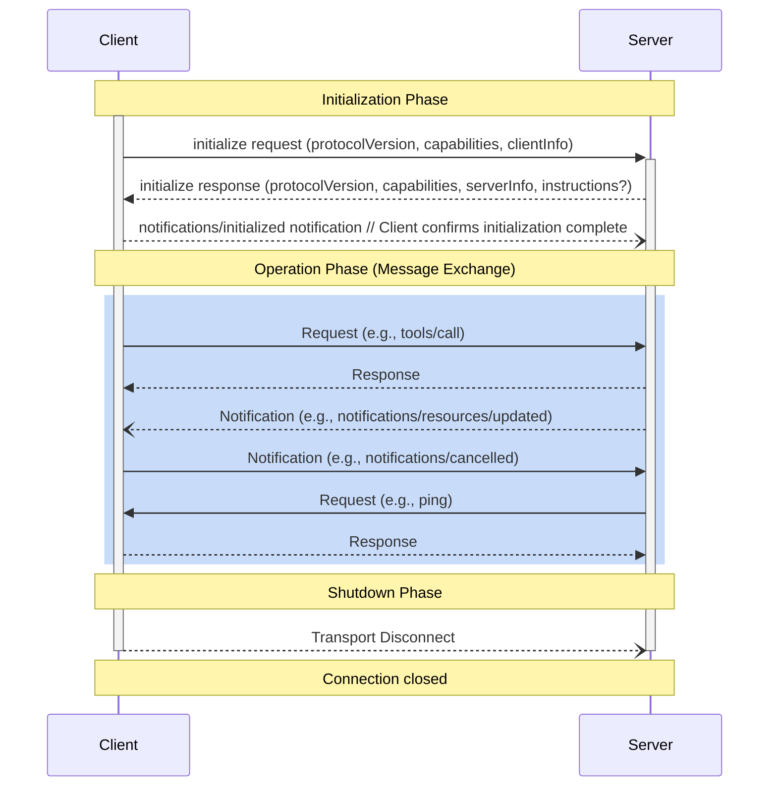

# Developer Note: My Custom `llms-full.txt` for TypeScript MCP Server Development

This file is my personal, condensed version of the official Model Context Protocol `llms-full.txt` (found at [https://modelcontextprotocol.io/llms-full.txt](https://modelcontextprotocol.io/llms-full.txt)) with a focus on Server development. I've tailored it specifically for my own development workflow, focusing primarily on building MCP servers using TypeScript.

Feed this file to your LLM when developing with MCP. It contains the essential information and examples I find most useful, while omitting some of the more verbose sections from the official document.

Instructions for using this file: Use this file as a reference for understanding the Model Context Protocol (MCP) and its implementation in TypeScript. It includes key concepts, protocol standards, and best practices for building MCP servers. The examples provided are specifically designed to help you quickly grasp the essentials of client & server development.

---

# Creating a Model Context Protocol (MCP) Server: Standards and Best Practices

[](https://modelcontextprotocol.io/)
[](https://github.com/modelcontextprotocol/typescript-sdk)
[](https://github.com/modelcontextprotocol/python-sdk)
[](https://github.com/modelcontextprotocol/kotlin-sdk)
[](https://github.com/modelcontextprotocol/java-sdk)
[](https://github.com/modelcontextprotocol/csharp-sdk)
[](https://github.com/modelcontextprotocol/modelcontextprotocol/blob/main/docs/specification/2025-03-26/changelog.mdx)
[]()

## 1. Introduction

The Model Context Protocol (MCP) provides a standardized communication layer enabling Large Language Models (LLMs) within host applications (clients) to interact securely and effectively with external data sources and tools via dedicated servers. Building an MCP server allows you to expose specific capabilities—such as accessing file systems, querying databases, interacting with APIs, or executing custom logic—to any MCP-compatible client application (e.g., Claude Desktop, IDE extensions, custom agents).

This document outlines the fundamental concepts, protocol standards, and modern best practices essential for developing robust, secure, and interoperable MCP servers. Adherence to these guidelines ensures your server integrates seamlessly into the growing MCP ecosystem.

## 2. Core Concepts & Architecture

MCP employs a client-server architecture facilitated by a host application:

- **Host:** An application (e.g., Claude Desktop, VS Code) that manages MCP clients and integrates with LLMs. The host enforces security, handles user consent, and orchestrates interactions.
- **Client:** Resides within the host, maintaining a 1:1 stateful connection with a specific MCP server. It handles protocol negotiation and message routing.
- **Server:** A standalone process (local or remote) that exposes specific capabilities (Resources, Tools, Prompts) to a connected client via the MCP protocol. Servers focus on their specific domain and do not directly interact with the LLM or other servers.


It's important to remember the division of responsibility: The Host application acts as the primary gatekeeper, managing user consent, connection security, and overall orchestration, while the Server focuses on securely implementing and exposing its specific capabilities within the boundaries set by the Host.

**Key Design Principles for Servers:**

1.  **Simplicity:** Servers should be easy to build, focusing on specific capabilities. Complex orchestration is handled by the host.
2.  **Composability:** Servers operate independently and can be combined by hosts.
3.  **Isolation:** Servers cannot access the full conversation history or interact directly with other servers. Context is provided selectively by the host/client.
4.  **Progressive Features:** Servers declare supported capabilities; features can be added incrementally.

## 3. Protocol Basics

MCP communication relies on **JSON-RPC 2.0** over a chosen transport layer.

### 3.1. Message Types

All communication uses standard JSON-RPC 2.0 messages:

- **Requests:** Sent by either client or server to invoke a method. MUST include `jsonrpc: "2.0"`, a `method`, and an `id` (string or number, not null). The `id` **MUST** be unique among all _outstanding_ requests from the sender. According to JSON-RPC 2.0, IDs **MAY** be reused once the corresponding response has been received. While reusing IDs is permitted by the protocol after a response is received, maintaining uniqueness for the entire session duration can simplify some client/server implementations, especially regarding reconnection logic. `params` are optional.
- **Responses:** Sent in reply to a request. MUST include `jsonrpc: "2.0"`, the same `id` as the request, and _either_ `result` (on success) or `error` (on failure).
- **Notifications:** One-way messages sent by either party. MUST include `jsonrpc: "2.0"` and `method`. MUST NOT include an `id`.

MCP implementations **MUST** support receiving JSON-RPC batches (arrays of requests/notifications/responses), even if they never send batches themselves. Servers **MAY** choose whether to send batches. The `initialize` request **MUST NOT** be batched, and servers **MUST** reject an `initialize` request if it arrives as part of a batch.

### 3.2. Connection Lifecycle

MCP connections follow a strict lifecycle:



1.  **Initialization:**
    - Client sends `initialize` request with its supported `protocolVersion` (latest preferred, e.g., "2025-03-26"), `capabilities`, and `clientInfo`.
    - Server responds with the agreed `protocolVersion` (MUST be supported by both), its `capabilities`, `serverInfo`, and optional `instructions`. The `instructions` field ([spec link](https://github.com/modelcontextprotocol/modelcontextprotocol/blob/main/docs/specification/2025-03-26/basic/lifecycle.mdx)) provides guidance for the client/LLM on how to interact with the server (e.g., persona, preferred usage). Clients typically surface this in the system prompt. Keep instructions concise (typically < 2 KiB). If versions mismatch irreconcilably, the server responds with an error or a supported version; the client disconnects if incompatible.
    - Client sends `initialized` notification. Normal operation begins.
2.  **Operation:** Client and server exchange requests, responses, and notifications based on negotiated capabilities.
3.  **Shutdown:** The connection is terminated via the transport layer (e.g., closing stdio streams, closing HTTP connections).

**Example: Server Initialization (TypeScript SDK)**

```typescript
import { McpServer } from "@modelcontextprotocol/sdk/server/mcp.js";
import { StdioServerTransport } from "@modelcontextprotocol/sdk/server/stdio.js";
import { StreamableHTTPServerTransport } from "@modelcontextprotocol/sdk/server/streamableHttp.js";
import { isInitializeRequest } from "@modelcontextprotocol/sdk/types.js";
import { logger } from "../utils/logger.js"; // Assuming a logger utility

// Server Info and Capabilities are defined during McpServer instantiation
const server = new McpServer(
  {
    // Server Information
    name: "my-echo-server",
    version: "1.0.0",
    // Add other server info fields as needed
  },
  {
    // Server Capabilities Declaration
    capabilities: {
      logging: {}, // Supports receiving log level settings and sending log messages
      resources: { listChanged: true, subscribe: true }, // Supports resources, list changes, and subscriptions
      tools: { listChanged: true }, // Supports tools and list changes
      // prompts: {}, // Declare if prompts are supported
      // completions: {}, // Declare if completions are supported
    },
    // Optional instructions for the client/LLM
    instructions: "This server provides echo tools and resources for testing.",
  }
);

logger.info("MCP Server instance created with capabilities.");

// Connection logic depends on the chosen transport (see Section 8)
// Example for Stdio:
// const transport = new StdioServerTransport();
// await server.connect(transport);
// logger.info("Server connected via Stdio.");

// Example for Streamable HTTP (simplified - see server.ts for full session handling):
// const transport = new StreamableHTTPServerTransport({ /* ... options ... */ });
// await server.connect(transport);
// logger.info("Server connected via Streamable HTTP.");
```

### 3.3. Capability Negotiation

During initialization, client and server exchange capabilities objects to declare supported features. Servers **MUST** declare capabilities for the features they offer (e.g., `resources`, `tools`, `prompts`, `logging`, `completions`). Optional sub-capabilities (like `listChanged` or `subscribe`) refine feature support. Communication **MUST** respect negotiated capabilities.

The example above shows how capabilities are declared in the `McpServer` constructor using the TypeScript SDK.

## 4. Server Capabilities

Servers expose functionality through three primary primitives:

### 4.1. Resources

- **Purpose:** Expose data/content (files, database records, API data) for clients/LLMs to read as context.
- **Control:** Application-controlled (client decides when/how to use).
- **Identification:** Unique URI (e.g., `file:///path/to/doc.txt`, `db://table/id`, custom schemes like `echo://`).
- **Discovery:**
  - `resources/list`: Client requests a list of available `Resource` objects (`uri`, `name`, `description`, `mimeType`, `size?`). Supports pagination (server MUST handle `cursor`/`nextCursor`).
  - `resources/templates/list`: Client requests `ResourceTemplate` objects (`uriTemplate`, `name`, etc.) for parameterized resources (e.g., `file:///{path}`). Supports pagination (server MUST handle `cursor`/`nextCursor`).
- **Reading:**
  - `resources/read`: Client requests content for a specific URI.
  - Response contains `ResourceContent` array (can be multiple, e.g., directory listing). Content can be `text` (UTF-8) or `blob` (Base64 binary).
- **Updates (Optional):**
  - Declare `listChanged: true` capability to send `notifications/resources/list_changed`.
  - Declare `subscribe: true` capability to handle `resources/subscribe` requests and send `notifications/resources/updated` for specific URIs. Servers **MUST** also handle the `resources/unsubscribe` **request** (which requires an `id` and returns an empty object `{}` result) to prevent subscription leaks when the client no longer needs updates for a specific URI.

**Example: Registering a Simple Resource (TypeScript SDK)**

```typescript
import { McpServer } from "@modelcontextprotocol/sdk/server/mcp.js";
import {
  ListResourcesRequestSchema,
  ReadResourceRequestSchema,
  Resource,
  TextResourceContents, // Use specific type for text content
} from "@modelcontextprotocol/sdk/types.js";
import { logger } from "../utils/logger.js"; // Assuming a logger utility

// Assume 'server' is an initialized McpServer instance
export const registerEchoResource = async (
  server: McpServer
): Promise<void> => {
  const echoResourceUri = "echo://hello";
  const echoResource: Resource = {
    uri: echoResourceUri,
    name: "Echo Message",
    description: "A simple echo resource that returns a fixed message.",
    mimeType: "text/plain",
  };

  // Handle requests to list resources
  server.setRequestHandler(ListResourcesRequestSchema, async (request) => {
    logger.debug("Handling ListResourcesRequest", { request });
    // In a real server, implement pagination using request.cursor
    return {
      resources: [echoResource],
      // nextCursor: '...' // Provide cursor if more resources exist
    };
  });

  // Handle requests to read a specific resource
  server.setRequestHandler(ReadResourceRequestSchema, async (request) => {
    logger.debug("Handling ReadResourceRequest", { request });
    if (request.uri === echoResourceUri) {
      // Corrected structure: use 'text' instead of 'content'
      const textContent: TextResourceContents = {
        uri: echoResourceUri,
        // type: "text", // Removed as per MCP Spec 2025-03-26
        mimeType: "text/plain", // Explicitly include mimeType here too
        text: "Hello from the echo resource!",
        // Note: 'encoding' field is not standard MCP; mimeType should indicate charset if needed.
      };
      return {
        contents: [textContent],
      };
    } else {
      // Standard JSON-RPC error for resource not found (MCP Spec Code)
      throw {
        code: -32002, // MCP Spec: Resource not found
        message: `Resource not found: ${request.uri}`,
      };
    }
  });

  logger.info(
    `Registered resource: ${echoResource.name} (${echoResource.uri})`
  );

  // If supporting subscriptions (subscribe: true capability):
  // server.setRequestHandler(SubscribeResourceRequestSchema, async (request) => { /* Handle subscribe request */ });
  // server.setRequestHandler(UnsubscribeResourceRequestSchema, async (request) => { /* Handle unsubscribe request (requires id) and reply {} */ }); // Server MUST handle this request if subscribe is true.
  // To send updates:
  // server.sendNotification('notifications/resources/updated', { uri: echoResourceUri });

  // If supporting list-change events (listChanged: true capability):
  // server.sendNotification('notifications/resources/list_changed', {});
};
```

### 4.2. Tools

- **Purpose:** Expose executable functions for the LLM to invoke (with user approval via the client) to perform actions or interact with systems.
- **Control:** Model-controlled (LLM decides when to call, client mediates).
- **Definition:** `Tool` object (`name`, `description`, `inputSchema` (JSON Schema), `annotations?`).
  - **Annotations (New in 2025-03-26):** Provide hints about tool behavior (`title`, `readOnlyHint`, `destructiveHint`, `idempotentHint`, `openWorldHint`). **Important:** Clients **MUST** treat all annotation fields as untrusted hints unless the server providing them is explicitly whitelisted or trusted by the host application or user. Servers should not rely on clients strictly adhering to these hints for security enforcement.
- **Discovery:**
  - `tools/list`: Client requests a list of available `Tool` objects. Supports pagination.
- **Invocation:**
  - `tools/call`: Client sends tool `name` and `arguments` matching the `inputSchema`.
  - Response is `CallToolResult` containing `content` (array of Text, Image, Audio, or Embedded Resource) and `isError` (boolean). Tool execution errors (e.g., API failure) are reported via `isError: true`, and details in `content`, _not_ as protocol-level errors.
  - **Importance of Rich Schemas:** Providing detailed JSON Schemas (with types, descriptions, required fields, enums, patterns, etc.) is crucial as it dramatically improves the LLM's ability to correctly format arguments and use the tool effectively.
- **Updates (Optional):**
  - Declare `listChanged: true` capability to send `notifications/tools/list_changed`. This notification **MUST** be sent after any operation that dynamically adds, removes, enables, disables, or updates tools to ensure client UIs remain synchronized. SDKs may provide helper functions (e.g., `sendToolListChanged()`).

**Example: Registering a Simple Tool (TypeScript SDK)**

```typescript
import { McpServer } from "@modelcontextprotocol/sdk/server/mcp.js";
import {
  CallToolRequestSchema,
  ListToolsRequestSchema,
  Tool,
  ToolInputSchema,
  CallToolResult,
  TextContent, // Use specific type
} from "@modelcontextprotocol/sdk/types.js";
import { logger } from "../utils/logger.js"; // Assuming a logger utility
import { z } from "zod"; // Using Zod for schema definition and validation

// Define the input schema using Zod
const EchoToolInput = z.object({
  message: z
    .string()
    .min(1)
    .max(1000)
    .describe("The message to echo back (1-1000 characters)"),
  mode: z
    .enum(["standard", "uppercase", "lowercase"])
    .default("standard")
    .describe("How to format the echoed message"),
  repeat: z
    .number()
    .int()
    .min(1)
    .max(10)
    .default(1)
    .describe("Number of times to repeat the message (1-10)"),
  timestamp: z
    .boolean()
    .default(true)
    .describe("Whether to include a timestamp"),
});

// Convert Zod schema to JSON Schema for MCP
const echoToolInputSchema: ToolInputSchema = {
  type: "object",
  properties: {
    message: {
      type: "string",
      minLength: 1,
      maxLength: 1000,
      description: "The message to echo back (1-1000 characters)",
    },
    mode: {
      type: "string",
      enum: ["standard", "uppercase", "lowercase"],
      default: "standard",
      description: "How to format the echoed message",
    },
    repeat: {
      type: "integer",
      minimum: 1,
      maximum: 10,
      default: 1,
      description: "Number of times to repeat the message (1-10)",
    },
    timestamp: {
      type: "boolean",
      default: true,
      description: "Whether to include a timestamp",
    },
  },
  required: ["message"],
};

// Note on Defaults: The JSON schema above includes 'default' values.
// Best Practice: When generating JSON Schema from Zod (e.g., using the
// `zod-to-json-schema` library), ensure you pass the `{ defaultValues: true }`
// option. This automatically includes the default values defined in your Zod
// schema in the generated JSON Schema, which is crucial for the LLM to
// correctly handle optional fields with defaults.

const echoTool: Tool = {
  name: "echo_message",
  description: "Echoes a message back with optional formatting and repetition.",
  inputSchema: echoToolInputSchema,
  // annotations: { title: "Echo Message Tool", readOnlyHint: true, "x-version": "1.0.0" } // Example annotations, including recommended versioning
};

export const registerEchoTool = async (server: McpServer): Promise<void> => {
  // Handle requests to call the tool using server.tool() for consistency
  // Note: The 4-argument overload `server.tool(name, description, schemaShape, handler)` shown below
  // requires TypeScript SDK version 1.10.2 or later. For SDK versions 1.10.0–1.10.1,
  // you must pass the full Zod schema object (e.g., `EchoToolInput`) instead of its `.shape`.
  // Alternatively, use the 3-argument overload `server.tool(name, zodSchema, handler)` which accepts the full schema.
  // Use the 4-argument overload available in SDK v1.10.2+ for cleaner integration with Zod schemas:
  // server.tool(name: string, description: string, schema: ZodRawShape, handler: ToolHandlerFn)
  // Note: The SDK helper `server.tool()` automatically handles registering the tool
  // for `tools/list` requests and validates arguments against the provided schema shape.
  server.tool(
    echoTool.name, // Tool name
    echoTool.description, // Tool description (Added for SDK v1.10.2+)
    EchoToolInput.shape, // Pass the Zod schema *shape*
    async (validatedArgs): Promise<CallToolResult> => {
      // validatedArgs are already parsed and validated against EchoToolInput.shape by server.tool()
      logger.debug("Executing validated echo_message tool", { validatedArgs });

      try {
        // Execute the tool logic (same as before)
        let responseMessage = validatedArgs.message;
        if (validatedArgs.mode === "uppercase") {
          responseMessage = responseMessage.toUpperCase();
        } else if (validatedArgs.mode === "lowercase") {
          responseMessage = responseMessage.toLowerCase();
        }

        const repeatedMessages = Array(validatedArgs.repeat).fill(
          responseMessage
        );
        let finalContent = repeatedMessages.join("\n");

        if (validatedArgs.timestamp) {
          finalContent = `[${new Date().toISOString()}] ${finalContent}`;
        }

        // Format the successful result
        const resultContent: TextContent = {
          type: "text",
          text: finalContent,
        };

        return {
          content: [resultContent],
          isError: false,
        };
      } catch (error) {
        // Catch execution errors (validation errors handled by server.tool)
        logger.error("Error executing echo_message tool logic", { error });
        let errorMessage = "Tool execution failed.";
        if (error instanceof Error) {
          errorMessage = error.message;
        }

        // Format the error result
        const errorContent: TextContent = {
          type: "text",
          text: `Error: ${errorMessage}`,
        };
        return {
          content: [errorContent],
          isError: true,
        };
      }
    }
  );

  logger.info(`Registered tool: ${echoTool.name} using server.tool()`);

  // If supporting list changes (listChanged: true capability):
  // server.sendNotification('notifications/tools/list_changed', {});
  // Best Practice: When sending list_changed, consider including version info in tool annotations
  // (e.g., "x-version": "1.1.0") so clients can detect breaking changes.

  // Best Practice: If a tool streams partial results, each chunk MUST use the same 'id'
  // as the original tools/call request. Only send notifications/progress updates if the
  // client provided a progressToken in the initial request.
};
```

### 4.3. Prompts

- **Purpose:** Provide reusable prompt templates or workflows, often surfaced as UI elements (e.g., slash commands) for users.
- **Control:** User-controlled (User explicitly selects/invokes).
- **Definition:** `Prompt` object (`name`, `description?`, `arguments?` list).
- **Discovery:**
  - `prompts/list`: Client requests a list of available `Prompt` objects. Supports pagination.
- **Usage:**
  - `prompts/get`: Client requests a specific prompt `name`, providing `arguments`.
  - Response is `GetPromptResult` containing `description?` and `messages` (array of `PromptMessage` with `role` and `content` - Text, Image, Audio, or Embedded Resource).
- **Updates (Optional):**
  - Declare `listChanged: true` capability to send `notifications/prompts/list_changed`.

**Example: Registering a Simple Prompt (TypeScript SDK)**

```typescript
import { McpServer } from "@modelcontextprotocol/sdk/server/mcp.js";
import {
  ListPromptsRequestSchema,
  GetPromptRequestSchema,
  Prompt,
  PromptArgument,
  GetPromptResult,
  PromptMessage,
  Role,
  TextContent, // Use specific type
} from "@modelcontextprotocol/sdk/types.js";
import { logger } from "../utils/logger.js"; // Assuming a logger utility

const summarizePromptArg: PromptArgument = {
  name: "text_to_summarize",
  description: "The text content you want to summarize.",
  required: true,
};

const summarizePrompt: Prompt = {
  name: "summarize_text",
  description:
    "Generates a prompt to ask the LLM to summarize the provided text.",
  arguments: [summarizePromptArg],
};

export const registerSummarizePrompt = async (
  server: McpServer
): Promise<void> => {
  // Handle requests to list prompts
  server.setRequestHandler(ListPromptsRequestSchema, async (request) => {
    logger.debug("Handling ListPromptsRequest", { request });
    return {
      prompts: [summarizePrompt],
    };
  });

  // Handle requests to get a specific prompt
  server.setRequestHandler(
    GetPromptRequestSchema,
    async (request): Promise<GetPromptResult> => {
      logger.debug("Handling GetPromptRequest", { request });
      if (request.name !== summarizePrompt.name) {
        throw { code: -32601, message: `Prompt not found: ${request.name}` };
      }

      const textArg = request.arguments?.[summarizePromptArg.name];
      if (typeof textArg !== "string" || !textArg) {
        throw {
          code: -32602,
          message: `Missing or invalid argument: ${summarizePromptArg.name}`,
        };
      }

      // Construct the messages for the LLM
      const userMessageContent: TextContent = {
        // Use specific type
        type: "text", // Use string literal
        text: `Please summarize the following text:\n\n${textArg}`,
      };
      const userMessage: PromptMessage = {
        role: Role.USER,
        content: [userMessageContent],
      };

      return {
        // description: `Requesting summary for text starting with: "${textArg.substring(0, 50)}..."`, // Optional description
        messages: [userMessage],
      };
    }
  );

  logger.info(`Registered prompt: ${summarizePrompt.name}`);

  // If supporting list changes (listChanged: true capability):
  // server.sendNotification('notifications/prompts/list_changed', {});
};
```

## 5. Interacting with Client Capabilities

Servers may need to interact with capabilities declared by the client:

### 5.1. Roots

- **Concept:** Clients can provide a list of filesystem "roots" (base URIs, typically `file://`) indicating relevant directories/workspaces.
- **Server Interaction:** If the client declares the `roots` capability, the server receives the initial list of roots during the `initialize` handshake. If the client also supports `listChanged` for roots, it will send `notifications/roots/list_changed` when the list updates. The specification currently **does not define** a `roots/list` request method; servers needing to request the list dynamically would need to define an experimental method (e.g., `experimental.roots/list`).
- **Usage:** Servers **SHOULD** respect these roots as operational boundaries when applicable (e.g., a filesystem server).

### 5.2. Sampling

- **Concept:** Allows servers to request LLM completions _through_ the client, enabling agentic behavior without needing server-side LLM API keys.
- **Server Interaction:** If the client declares the `sampling` capability, the server can send a `sampling/createMessage` request.
  - **Parameters:** `messages` (conversation history), `modelPreferences` (`hints`, priorities for cost/speed/intelligence), `systemPrompt?`, `includeContext?` (scope of MCP context - **Note:** This is an advisory hint with enum values `"allServers"`, `"thisServer"`, or `"none"`; clients **MAY** ignore this hint and provide more or less context than requested. Servers should not rely on this for strict context control.), `temperature?`, `maxTokens`, `stopSequences?`, `metadata?`.
  - **Response:** `CreateMessageResult` containing the LLM's response (`role`, `content`, `model` used, `stopReason`).
- **Important:** Clients **SHOULD** implement human-in-the-loop controls, allowing users to review/edit/approve sampling requests and responses.

## 6. Server Utilities

MCP defines several utility protocols servers can support:

- **Logging:** If `logging` capability is declared, server can send `notifications/message` with `level`, `logger?`, and `data`. The `level` **MUST** be one of the eight standard Syslog severity levels defined in [RFC 5424](https://tools.ietf.org/html/rfc5424#section-6.2.1): `debug`, `info`, `notice`, `warning`, `error`, `critical`, `alert`, or `emergency` ([spec link](https://github.com/modelcontextprotocol/modelcontextprotocol/blob/main/docs/specification/2025-03-26/server/utilities/logging.mdx)). Note that the level is `warning`, not `warn`, and the `notice` level exists between `info` and `warning`. Clients can optionally send `logging/setLevel` to control verbosity.
- **Pagination:** List operations (`resources/list`, `tools/list`, etc.) can return a `nextCursor`. Clients pass this cursor in subsequent requests to get the next page. Servers determine page size.
- **Completion:** If `completions` capability is declared, clients can send `completion/complete` for prompt/resource arguments, receiving suggestions.
- **Cancellation:** Either party can send `notifications/cancelled` with a `requestId` to attempt cancellation of an in-progress request. Best-effort, handles race conditions.
- **Ping:** Either party can send a `ping` request; the receiver **MUST** respond promptly with an empty result `{}` to confirm liveness.
- **Progress & Configuration (New in 2025-03-26):** The specification also includes mechanisms for servers to send progress updates (`notifications/progress`) for long-running operations and for clients to manage server-specific settings (`configuration/get`, `configuration/set`). **Note:** To receive progress updates, the client **MUST** include a `_meta: { progressToken: "..." }` envelope **as a sibling of `arguments` inside the `params` object** of the original request that initiates the long-running operation. The server then includes this `progressToken` in subsequent `notifications/progress` messages. While less common than core capabilities, servers can implement these if needed.
- **Notification Back-pressure:** Clients **MUST** be prepared to debounce rapid sequences of `listChanged` or `updated` notifications as per the specification's Behavior Requirements ([spec link](https://github.com/modelcontextprotocol/modelcontextprotocol/blob/main/docs/specification/2025-03-26/basic/behavior.mdx)). Servers should design update logic to be idempotent, as clients might miss intermediate notifications if the server sends them in rapid bursts.

**Example: Sending a Log Notification (TypeScript SDK)**

```typescript
import { McpServer } from "@modelcontextprotocol/sdk/server/mcp.js";

// Assume 'server' is an initialized McpServer instance
// Check if client supports logging during initialization or via server.clientCapabilities

// Send an informational log message using the correct payload shape
// Note: The SDK's sendNotification handles wrapping this in the full JSON-RPC envelope.
// If constructing manually, this object would be the value of the 'params' key.
server.sendNotification("notifications/message", {
  level: "info", // Use string literal from RFC 5424
  data: "Tool execution started.", // Message content goes in 'data'
  logger: "ToolExecutor", // Optional logger name
});

// Send a debug message with structured data
server.sendNotification("notifications/message", {
  level: "debug", // Use string literal from RFC 5424
  data: {
    // Structured data is allowed
    message: "Validated arguments.",
    validationResult: "success",
    toolName: "echo_message",
  },
  logger: "ToolExecutor",
});

// Send a warning message
server.sendNotification("notifications/message", {
  level: "warning", // Correct level name
  data: "Potential issue detected during tool execution.",
  logger: "ToolExecutor",
});
```

## 7. Building Your Server: SDKs and Best Practices

Official SDKs (Python, TypeScript, Java, C#, Kotlin) simplify server development.

### 7.1. High-Level vs. Low-Level SDK Usage

- **High-Level SDKs (Recommended for most use cases):**

  - Abstract away raw JSON-RPC messages and protocol details.
  - Use decorators, annotations, or builder patterns (e.g., Python's `FastMCP` `@mcp.tool()`, Java's `@Tool` annotation, TypeScript's `server.tool(...)` - _Note: TS SDK currently focuses on lower-level handlers_).
  - Developers define functions/methods with type hints and docstrings/descriptions; the SDK handles schema generation, request routing, and response formatting.
  - **Example (Python FastMCP):**

    ```python
    from mcp.server.fastmcp import FastMCP
    mcp = FastMCP("my-server")

    @mcp.tool()
    async def add_numbers(a: int, b: int) -> str:
      """Adds two integers together."""
      return str(a + b)
    ```

  - **Pros:** Faster development, less boilerplate, reduced protocol knowledge required.
  - **Cons:** Less direct control over protocol nuances.

- **Low-Level SDKs:**

  - Require manual handling of request/response objects (e.g., `ListToolsRequestSchema`, `CallToolRequest`).
  - Developers explicitly register handlers for specific message types using schemas.
  - Full control over message construction and parsing.
  - **Example (TypeScript Low-Level - using `server.tool()`):**

    ```typescript
    import { McpServer } from "@modelcontextprotocol/sdk/server/mcp.js";
    import { z } from "zod"; // Need Zod for schema definition
    import {
      TextContent,
      CallToolResult,
    } from "@modelcontextprotocol/sdk/types.js"; // Need specific content type and result type

    // Assume 'server' is an initialized McpServer instance

    // Define schema shape for the tool using Zod
    const MyToolInputSchema = z.object({
      param1: z.string().describe("Description for parameter 1"),
      param2: z.number().optional().describe("Optional parameter 2"),
    });
    type MyToolInput = z.infer<typeof MyToolInputSchema>;

    // Register the tool using server.tool()
    server.tool(
      "my_tool", // Tool name
      "Description of my tool.", // Tool description
      MyToolInputSchema.shape, // Pass the Zod schema shape
      async (validatedArgs: MyToolInput): Promise<CallToolResult> => {
        // 'validatedArgs' are already parsed and validated by the SDK
        // ... logic to execute the tool using validatedArgs ...
        const resultText = `Executed my_tool with param1: ${validatedArgs.param1}`;
        const resultContent: TextContent = { type: "text", text: resultText };
        return {
          content: [resultContent],
          isError: false,
        };
        // Handle execution errors by returning { content: [...], isError: true }
      }
    );
    ```

  - **Pros:** Maximum flexibility and control.
  - **Cons:** More verbose, requires deeper understanding of the MCP specification.

### 7.2. Modern Best Practices (2025)

1.  **Use Appropriate SDK Level:** Choose high-level SDKs for speed if available and suitable, or low-level for fine-grained control (as often needed in TypeScript currently).
2.  **Asynchronous Implementation:** Implement server logic asynchronously (`async`/`await` in TS) to handle I/O efficiently and support concurrent clients, especially for HTTP transports.
3.  **Type Safety:** Leverage TypeScript's type system. Use validation libraries like Zod for input schemas and runtime validation.
4.  **Clear Schemas and Descriptions:** Provide accurate, detailed JSON Schemas for tool inputs and comprehensive descriptions for all capabilities. Use Zod or similar to define schemas and generate JSON Schema. Use annotations where appropriate.
5.  **Structured Logging:**
    - For `stdio` transport, servers **MAY** log JSON objects to `stderr` for debugging or operational insight, as specified. The client/host can capture this. This is optional and separate from the MCP `notifications/message` mechanism. **Do not log MCP messages to `stdout`**.
    - For all transports, use the `notifications/message` mechanism if the client supports the `logging` capability. Provide structured data in the `data` field. Use a dedicated logger utility.
6.  **Robust Error Handling:**
    - Distinguish between protocol errors (throw JSON-RPC error objects) and execution errors (return `isError: true` in `CallToolResult`).
    - Provide clear error messages.
    - Use a centralized error handler for unexpected issues.
7.  **Security First:** (See Section 9).
8.  **Idempotency:** Design tools to be idempotent where possible. Use the `idempotentHint` annotation.
9.  **State Management:** Be mindful of server state, especially with HTTP transports handling multiple clients. Use session management features like those in the Streamable HTTP transport if needed.
10. **Testing:** Implement unit tests (e.g., using Vitest/Jest) for tool/resource logic and integration tests. Use the [MCP Inspector](https://github.com/modelcontextprotocol/inspector) for interactive testing.

## 8. Transport Layer Details

Servers must implement one or more transport mechanisms.

### 8.1. Stdio Transport

- **Mechanism:** Client launches server as subprocess. Communication via `stdin` (client->server) and `stdout` (server->client). Logging via `stderr`.
- **Formatting:** Each message (request, response, or notification, whether single or a batch array) **MUST** be sent as a single line of valid JSON, terminated by a newline character (`\n`). Pretty-printing is disallowed. Base64 encoded strings (`blob` content) inside a JSON string **cannot** contain literal newline bytes (0x0A); any newlines within the encoded data **MUST** be represented as the escaped sequence `\\n` within the JSON string itself. Servers and clients **MUST** correctly handle these escaped `\\n` sequences within JSON strings containing Base64 data. Avoid unescaped line feed characters (`\n`) in whitespace-insensitive positions within the JSON structure itself. Example: `{"jsonrpc":"2.0","method":"ping","id":1}\n`.
- **Use Case:** Ideal for local integrations, simple process communication.
- **Shutdown:** Server should exit gracefully when its `stdin` is closed by the client.

**Example: Setting up Stdio Transport (TypeScript SDK)**

```typescript
import { McpServer } from "@modelcontextprotocol/sdk/server/mcp.js";
import { StdioServerTransport } from "@modelcontextprotocol/sdk/server/stdio.js";
import { logger } from "../utils/logger.js"; // Assuming a logger utility

// Assume 'createMcpServerInstance' creates and configures the McpServer
async function startStdioServer() {
  try {
    logger.info("Connecting server via Stdio transport...");
    const server = await createMcpServerInstance(); // Create the server instance
    const transport = new StdioServerTransport();

    // Handle transport closure
    transport.onclose = () => {
      logger.info("Stdio transport closed. Exiting server.");
      process.exit(0); // Exit gracefully when stdin closes
    };

    await server.connect(transport);
    logger.info(`Server connected successfully via stdio`);
  } catch (error) {
    logger.error("Failed to start Stdio server", { error });
    process.exit(1);
  }
}

// Call this function when TRANSPORT_TYPE is 'stdio'
// startStdioServer();
```

### 8.2. Streamable HTTP Transport (Replaces HTTP+SSE from 2024-11-05 Spec)

- **Mechanism:** Server exposes a single HTTP endpoint path supporting `POST` (client->server messages) and `GET` (client initiates server->client stream). Uses Server-Sent Events (SSE) for streaming.
- **Client POST:** Client sends JSON-RPC message(s) (single or batch) in POST body.
  - **Response Handling:** The server decides the response format. If the POST contains requests requiring a reply, the server **MUST** respond with either `Content-Type: application/json` (single JSON response object) or `Content-Type: text/event-stream` (initiating an SSE stream for potentially multiple responses/notifications/requests). The client **MUST** support receiving both formats.
  - **Accept Header:** For every `POST` request, the client **SHOULD** include an `Accept` header listing both `application/json` and `text/event-stream` (e.g., `Accept: application/json, text/event-stream`). While recommended, this header is not strictly required by the spec. Servers **SHOULD** respect this header if present but **MUST** gracefully handle requests where the header is missing or lists the types in a different order, typically defaulting to `application/json` or choosing based on the response content.
  - **Notifications Only:** If the POST contains only notifications/responses (no requests expecting a reply), the server returns `202 Accepted`.
- **Client GET:** Client sends `GET` with an `Accept: text/event-stream` header to establish a persistent SSE stream for server-initiated messages (notifications, requests). Server responds with `Content-Type: text/event-stream` or `405 Method Not Allowed` if GET is not supported.
- **Session Management (Optional):** Server can return `Mcp-Session-Id` header on `initialize` response. Client MUST include this header on subsequent requests. Server can invalidate sessions (respond `404`). Client can send `DELETE` with header to terminate session.
- **Resumability (Optional):** Server can add `id` to SSE events. Client can use `Last-Event-ID` header on GET to resume after disconnection.
- **Security:** **CRITICAL:** Validate `Origin` header, bind to `127.0.0.1` for local servers, implement authentication ([MCP Auth Spec](https://github.com/modelcontextprotocol/specification/blob/main/docs/specification/2025-03-26/basic/authorization.md) or custom).
- **Use Case:** Remote servers, web-based clients, scenarios requiring concurrent connections or server-initiated messages.

**Example: Setting up Streamable HTTP Transport (TypeScript SDK - Simplified)**

_Note: See the provided `server.ts` for a more complete example with Express, session management, and proper request handling._

```typescript
import { McpServer } from "@modelcontextprotocol/sdk/server/mcp.js";
import { StreamableHTTPServerTransport } from "@modelcontextprotocol/sdk/server/streamableHttp.js";
import { isInitializeRequest } from "@modelcontextprotocol/sdk/types.js";
import express, { NextFunction, Request, Response } from "express";
import http from "http";
import { randomUUID } from "node:crypto";
import { logger } from "../utils/logger.js"; // Assuming a logger utility

const HTTP_PORT = 3000;
const HTTP_HOST = "127.0.0.1"; // Default to localhost
const MCP_ENDPOINT_PATH = "/mcp";

// Store transports by session ID
const httpTransports: { [sessionId: string]: StreamableHTTPServerTransport } =
  {};
// Store server instances by session ID (optional, depends on state needs)
// const httpServers: { [sessionId: string]: McpServer } = {};

async function startHttpServer() {
  const app = express();
  app.use(express.json());

  // Basic Origin Check Middleware (Example - Needs refinement for production)
  app.use((req: Request, res: Response, next: NextFunction) => {
    const origin = req.headers.origin;
    logger.debug(`HTTP Request: ${req.method} ${req.url}`, {
      origin,
      sessionId: req.headers["mcp-session-id"],
    });
    // CRITICAL Security: Implement robust origin validation.
    // Option 1: Strict localhost binding (ensure HTTP_HOST is ONLY 127.0.0.1 or localhost)
    // Option 2: Use an allowlist for trusted origins.
    const isLocalhostBinding =
      HTTP_HOST === "127.0.0.1" || HTTP_HOST === "localhost";
    const allowedOrigins = process.env.MCP_ALLOWED_ORIGINS?.split(",") || []; // Example allowlist

    // Allow requests if:
    // 1. Origin header is present AND is in the configured allowlist
    // 2. Server is bound to localhost AND Origin header is missing OR 'null' (common for Electron/local file://)
    const isOriginAllowed =
      (origin && allowedOrigins.includes(origin)) ||
      (isLocalhostBinding && (!origin || origin === "null")); // Allow missing or 'null' Origin only for localhost binding

    if (!isOriginAllowed) {
      logger.warn(
        `Forbidden: Invalid Origin: ${origin}. Allowed: ${allowedOrigins.join(
          ", "
        )}. Localhost binding: ${isLocalhostBinding}`
      );
      return res.status(403).send("Forbidden: Invalid Origin");
    }
    // Set CORS header ONLY if origin is present and allowed
    if (origin) {
      res.setHeader("Access-Control-Allow-Origin", origin);
      // Add other necessary CORS headers (Methods, Headers, Credentials if needed)
      // res.setHeader('Access-Control-Allow-Methods', 'GET, POST, DELETE, OPTIONS');
      // res.setHeader('Access-Control-Allow-Headers', 'Content-Type, Mcp-Session-Id, Last-Event-ID');
      // res.setHeader('Access-Control-Allow-Credentials', 'true'); // If using cookies/auth
    }
    next();
  });

  // Unified handler for POST, GET, DELETE
  const handleMcpRequest = async (req: Request, res: Response) => {
    const sessionId = req.headers["mcp-session-id"] as string | undefined;
    let transport = sessionId ? httpTransports[sessionId] : undefined;

    try {
      if (req.method === "POST") {
        if (transport) {
          logger.debug(`Reusing transport for session: ${sessionId}`);
        } else if (isInitializeRequest(req.body)) {
          logger.info(
            `New init request. Creating transport & server for new session.`
          );
          transport = new StreamableHTTPServerTransport({
            sessionIdGenerator: () => randomUUID(),
            onsessioninitialized: (newSessionId) => {
              if (transport) {
                httpTransports[newSessionId] = transport;
                logger.info(`Session initialized: ${newSessionId}`);
              }
            },
          });
          transport.onclose = () => {
            if (transport?.sessionId && httpTransports[transport.sessionId]) {
              logger.info(
                `Session closed, removing transport: ${transport.sessionId}`
              );
              delete httpTransports[transport.sessionId];
              // Optionally delete server instance if stateful per session
              // delete httpServers[transport.sessionId];
            }
          };
          // Create a NEW server instance for this session
          const server = await createMcpServerInstance(); // Assumes this function exists
          await server.connect(transport);
          // httpServers[transport.sessionId] = server; // Store if needed
        } else {
          logger.warn(
            `Bad Request: No valid session ID for non-initialize POST.`
          );
          return res.status(400).json({
            jsonrpc: "2.0",
            error: {
              code: -32000,
              message: "Bad Request: Session ID required",
            },
            id: null,
          });
        }
      }

      if (!transport) {
        logger.warn(
          `No transport found for session ID: ${sessionId} on ${req.method}`
        );
        return res.status(400).send("Invalid or missing session ID");
      }

      // Let the transport handle the underlying request/response/SSE/DELETE
      await transport.handleRequest(
        req,
        res,
        req.method === "POST" ? req.body : undefined
      );
      logger.debug(
        `${req.method} handled for session: ${
          transport.sessionId || "(pending init)"
        }`
      );
    } catch (error) {
      logger.error(`Error handling ${req.method} for session ${sessionId}`, {
        error,
      });
      if (!res.headersSent) {
        res.status(500).send("Internal Server Error");
      }
    }
  };

  app.post(MCP_ENDPOINT_PATH, handleMcpRequest);
  app.get(MCP_ENDPOINT_PATH, handleMcpRequest);
  app.delete(MCP_ENDPOINT_PATH, handleMcpRequest);

  const httpServerInstance = http.createServer(app);
  httpServerInstance.listen(HTTP_PORT, HTTP_HOST, () => {
    logger.info(
      `HTTP server listening on http://${HTTP_HOST}:${HTTP_PORT}${MCP_ENDPOINT_PATH}`
    );
  });
}

// Call this function when TRANSPORT_TYPE is 'http'
// startHttpServer();
```

## 9. Security Considerations for Servers

Security is paramount when building MCP servers. While the host/client manages user consent, server design directly impacts safety.

| Attack Vector          | Mitigation Strategy                                                                                                  |
| :--------------------- | :------------------------------------------------------------------------------------------------------------------- |
| **Injection**          | Rigorous input validation (schemas, sanitization), parameterized queries (SQL), avoid command interpolation.         |
| **Path Traversal**     | Validate/sanitize file paths, resolve paths relative to allowed roots, avoid user input directly in path operations. |
| **Denial of Service**  | Implement rate limiting on requests (especially tools/API calls), resource limits (CPU/memory).                      |
| **Data Exposure**      | Least privilege principle, access control checks, output sanitization, avoid logging sensitive data.                 |
| **Insecure Transport** | Use HTTPS for HTTP transport, implement authentication (MCP Auth Spec, API keys, JWT), validate `Origin` header.     |
| **CSRF (HTTP)**        | Use CSRF tokens or strict SameSite cookie policies if using cookie-based authentication with HTTP transport.         |
| **Dependency Vulns**   | Regularly update dependencies and audit for known vulnerabilities (`npm audit`, `yarn audit`).                       |

Key security practices include:

1.  **Input Validation:** Rigorously validate _all_ inputs (tool arguments, resource URIs, prompt arguments) against defined schemas (e.g., using Zod in TypeScript). Sanitize inputs to prevent injection attacks (command injection, SQL injection, path traversal).
2.  **Access Control:** Implement checks to ensure operations only affect permitted data/systems. Respect filesystem roots provided by the client. If handling sensitive data, consider server-level authentication/authorization beyond the client's connection.
3.  **Least Privilege:** Design servers and tools to operate with the minimum necessary permissions.
4.  **Rate Limiting:** Implement rate limiting for resource-intensive or external API-calling tools to prevent abuse and manage costs (e.g., using middleware in Express).
5.  **Secrets Management:** Never hardcode secrets (API keys, passwords). Use environment variables (`process.env`), dedicated secrets managers, or secure configuration methods. Avoid logging secrets.
6.  **Output Sanitization:** Ensure data returned (e.g., in tool results or resources) does not inadvertently leak sensitive information.
7.  **Dependency Security:** Keep server dependencies updated (`npm audit`, `yarn audit`) to patch known vulnerabilities.
8.  **Transport Security:** For HTTP transports, always use HTTPS in production. Implement authentication as per the [MCP Auth Spec](https://github.com/modelcontextprotocol/specification/blob/main/docs/specification/2025-03-26/basic/authorization.md) or other robust methods (e.g., API keys, JWT). Validate `Origin` headers against an allowlist. Bind to `127.0.0.1` unless external access is explicitly required and secured. For servers exposed publicly or handling sensitive actions, also consider standard web security practices like CSRF protection. If using cookie-based authentication with HTTP transports (especially SSE), implementing CSRF protection (e.g., via CSRF tokens or strict SameSite cookie policies) is crucial to prevent cross-site request forgery attacks, although these mechanisms are beyond the core MCP specification itself.

**Example: Basic Origin Check Middleware (Express)**

```typescript
import { Request, Response, NextFunction } from "express";
import { logger } from "../utils/logger.js";

const ALLOWED_ORIGINS = process.env.MCP_ALLOWED_ORIGINS?.split(",") || []; // Load from env

export function originCheckMiddleware(
  req: Request,
  res: Response,
  next: NextFunction
) {
  const origin = req.headers.origin;
  const host = req.hostname; // Use req.hostname which resolves based on Host header
  // Check if the server is effectively bound only to loopback addresses
  const isLocalhostBinding = ["127.0.0.1", "::1", "localhost"].includes(host);

  // Determine if the origin is allowed. Note: Browsers might send `Origin: null`
  // for requests from local files (`file://`) or sandboxed iframes (common in Electron apps).
  // Accepting `Origin: null` is generally safe *only* if the server is strictly bound
  // to localhost (127.0.0.1 or ::1) and not accessible externally. Rejecting `null`
  // origins when bound to localhost can break local Electron-style hosts.
  const isOriginAllowed =
    (origin && ALLOWED_ORIGINS.includes(origin)) || // Allow if origin is in the list
    (isLocalhostBinding && (!origin || origin === "null")); // Allow missing or 'null' Origin only for localhost binding

  if (isOriginAllowed) {
    logger.debug(`Origin allowed: ${origin || "(missing/null)"} for host ${host}`);
    if (origin) {
      // Set CORS header only if origin is present and allowed
      res.setHeader("Access-Control-Allow-Origin", origin);
      // Add other necessary CORS headers like Allow-Methods, Allow-Headers if needed
      // res.setHeader('Access-Control-Allow-Methods', 'GET, POST, DELETE, OPTIONS');
      // res.setHeader('Access-Control-Allow-Headers', 'Content-Type, Mcp-Session-Id, Last-Event-ID');
    }
    next();
  } else {
    logger.warn(`Forbidden: Origin not allowed: ${origin}`, {
      host,
      allowed: ALLOWED_ORIGINS,
    });
    res.status(403).send("Forbidden: Invalid Origin");
  }
}

// Usage in Express app:
// import express from 'express';
// const app = express();
// app.use(originCheckMiddleware);
// ... rest of your routes ...
```

## 10. Debugging and Testing

- **Logging:** Use `stderr` for stdio (preferably structured JSON) or `notifications/message` for structured logging via MCP. Use a robust logging library (e.g., Winston, Pino).
- **MCP Inspector:** Use the official [MCP Inspector](https://github.com/modelcontextprotocol/inspector) tool (`npx @modelcontextprotocol/inspector`) to connect directly to your server (via stdio or HTTP) for interactive testing of capabilities without needing a full host application.
- **Testing:** Write unit tests for tool/resource logic (e.g., using Vitest, Jest) and integration tests simulating client interactions.

## 11. Versioning and Roadmap

- MCP uses `YYYY-MM-DD` version strings (e.g., `2025-03-26`). Versions only change upon backwards-incompatible updates.
- Servers should aim to support the latest stable protocol version.
- Consult the official [specification repository](https://github.com/modelcontextprotocol/specification) for planned future features (e.g., Registry, Agents, Multimodality).

## 12. Conclusion

Building an MCP server involves implementing specific capabilities (Resources, Tools, Prompts) according to the JSON-RPC based protocol, negotiating features with clients, and adhering to security best practices. Leveraging official SDKs, particularly high-level abstractions where available, significantly simplifies development. By following these standards, your server can reliably and securely extend the capabilities of diverse AI applications within the MCP ecosystem.
