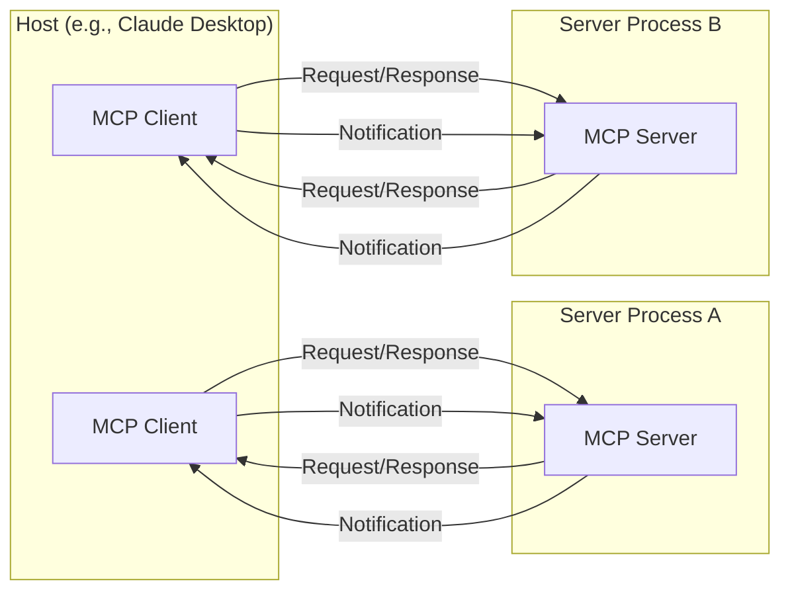
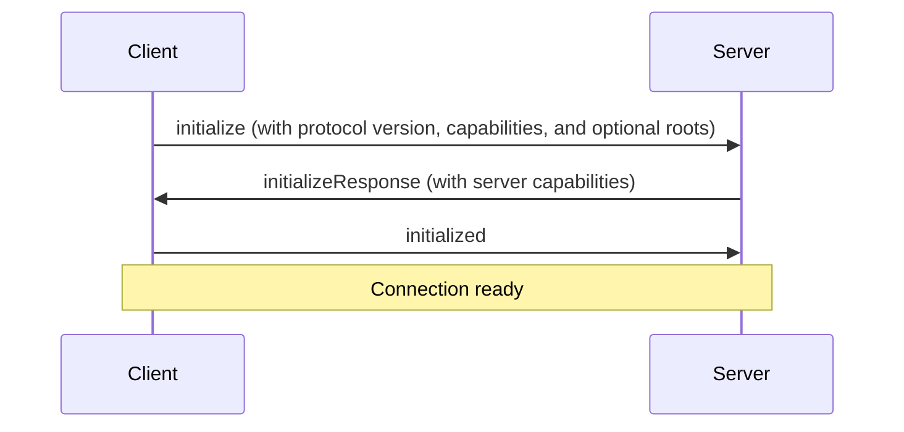

# MCP Client Development Guide: Building Robust and Flexible LLM Integrations

[](https://modelcontextprotocol.io/)
[](https://github.com/modelcontextprotocol/typescript-sdk)
[](https://github.com/modelcontextprotocol/python-sdk)
[](https://github.com/modelcontextprotocol/kotlin-sdk)

Hi there! This guide is meant to be a helpful resource for anyone looking to build clients for the **Model Context Protocol (MCP)**. I've tried my best to cover the important stuff and provide accurate examples, but please create an issue on this GitHub repository if you find any errors, inconsistencies, or areas that could be improved. Your feedback is appreciated! Whether you're just starting out with MCP or you're already familiar and want to dive deeper, I hope you'll find some useful examples and tips here. This guide is all about making it easier to create solid LLM integrations, so hopefully, it helps you build something cool! 

Note: For this guide, I'll be focusing on TypeScript implementation details. A dedicated Python-specific guide will be released separately.

## Table of Contents

1. [Introduction](#1-introduction)
    *   [Why MCP?](#why-mcp)
2. [Core Architecture](#2-core-architecture)
    *   [Overview](#overview)
    *   [Core Components](#core-components)
    *   [Connection Lifecycle](#connection-lifecycle)
    *   [Error Handling](#error-handling)
3. [Lifecycle: Connection, Exchange, and Termination](#3-lifecycle-connection-exchange-and-termination)
    *   [Initialization](#initialization)
    *   [Message Exchange](#message-exchange)
    *   [Termination](#termination)
4. [Step-by-Step: Building an MCP Client in TypeScript](#4-step-by-step-building-an-mcp-client-in-typescript)
    *   [4.1. Installing the MCP SDK](#41-installing-the-mcp-sdk)
    *   [4.2. Connecting to a Server](#42-connecting-to-a-server)
    *   [4.3. Discovering Tools, Prompts, and Resources](#43-discovering-tools-prompts-and-resources)
    *   [4.4. Handling Tool Calls and Schema Validation](#44-handling-tool-calls-and-schema-validation)
    *   [4.5. Reading Resources](#45-reading-resources)
    *   [4.6. Using Prompts](#46-using-prompts)
    *   [4.7. Running Queries with LLM Integration and Context Re-injection](#47-running-queries-with-llm-integration-and-context-re-injection)
    *   [4.8. Human-in-the-Loop (Tool Call Approval)](#48-human-in-the-loop-tool-call-approval)
    *   [4.9. Example: Full TypeScript Code](#49-example-full-typescript-code)
5. [Advanced Topics](#5-advanced-topics)
    *   [5.1. Sampling](#51-sampling)
    *   [5.2. Multi-Server Connections](#52-multi-server-connections)
    *   [5.3. Multi-Step (Agentic) Flows](#53-multi-step-agentic-flows)
    *   [5.4. Resource Subscriptions](#54-resource-subscriptions)
    *   [5.5. Roots Feature](#55-roots-feature)
    *   [5.6. Progress / Partial Results](#56-progress--partial-results)
    *   [5.7. Multi-Server Aggregation](#57-multi-server-aggregation)
    *   [5.8. Tool Error Objects](#58-tool-error-objects)
    *   [5.9. Handling List Endpoint Updates](#59-handling-list-endpoint-updates)
6. [Error Handling, Security, and Best Practices](#6-error-handling-security-and-best-practices)
    *   [6.1. Error Handling](#61-error-handling)
    *   [6.2. Security](#62-security)
    *   [6.3. Performance & Logging](#63-performance--logging)
    *   [6.4. Best Practices](#64-best-practices)
7. [Debugging and Next Steps](#7-debugging-and-next-steps)
    *   [7.1. Debugging Tools](#71-debugging-tools)
8. [Conclusion](#conclusion)

## 1. Introduction

The **Model Context Protocol (MCP)** is an open standard that defines how Large Language Model (LLM) applications, referred to as **host applications**, access data, prompts, and tools. It acts as a universal connector, enabling your host application (an LLM-based chatbot, IDE, or any AI system) to communicate seamlessly with any MCP server. Within the host application, an **MCP client** component is responsible for managing these connections. Each client maintains a 1:1 connection with a specific MCP server.

**Analogy:** Just as USB-C unifies device connectivity, MCP unifies AI application integrations.

**Capabilities Gained Through MCP:**

*   **Tools:** Functionality like running shell commands, querying databases, or interacting with APIs.
*   **Resources:** Access to file contents, logs, or other data to provide context to the LLM. *Resources are application-controlled.*
*   **Prompts:** Predefined prompt templates or workflows to guide the LLM's behavior.
*   **Roots:** A way for clients to inform servers about relevant resources and their locations. *Roots are informational and help guide the server's operations, but are not strictly enforced. They serve as suggestions rather than a core capability like Tools, Resources, or Prompts.*

### Why MCP?

1. **Single Integration Point:** Add capabilities from any MCP server (filesystems, Git, Slack, or custom solutions) through a single, consistent protocol.
2. **LLM Independence:** Switch between LLM providers without altering your data integration strategy.
3. **Security & Human Control:** MCP incorporates built-in patterns for human approval and robust security checks, ensuring that tools and data are used responsibly. *Tool calls can be approved by the user before execution.*
4. **Extensibility:** Easily integrate new tools, data sources, and prompts by connecting to additional MCP servers.
## 2. Core Architecture

### Overview

MCP adopts a client-server architecture:

*   **Host Application:** The application that embeds the MCP client (e.g., Claude Desktop, an IDE, a custom chatbot). The host application contains the LLM and manages user interactions.
*   **MCP Client:** A component *within* the host application that maintains a 1:1 connection with each MCP server. Responsible for protocol communication, capability management, and mediating between the host application and MCP servers.
*   **MCP Server:** An independent process that provides context, tools, prompts, or other capabilities to the MCP client.



### Core Components

#### Protocol Layer

*   Handles message framing, request-response linking, and communication using the JSON-RPC 2.0 standard.
*   **TypeScript:** The `Client` class provides hooks for request/notification handlers.

**TypeScript Example (Protocol Layer):**

```typescript
import { Client, type RequestHandler, type NotificationHandler } from "@modelcontextprotocol/sdk/client/index.js";

class MyMCPClient {
  private client: Client;

  constructor() {
    this.client = new Client({ name: "my-client", version: "1.0.0" }, {});
  }

  // Handle incoming requests
  setRequestHandler<T, R>(method: string, handler: RequestHandler<T, R>): void {
    this.client.setRequestHandler(method, handler);
  }

  // Handle incoming notifications
  setNotificationHandler<T>(method: string, handler: NotificationHandler<T>): void {
    this.client.setNotificationHandler(method, handler);
  }

  // ... other methods for sending requests and notifications
}
```

**All communication uses JSON-RPC 2.0 to package requests, responses, and notifications.**

### Connection Lifecycle

The connection lifecycle consists of three phases: Initialization, Message Exchange, and Termination.

### Error Handling

MCP uses standard JSON-RPC 2.0 error codes for error handling.

## 3. Lifecycle: Connection, Exchange, and Termination

### Initialization

1. **Client** sends `initialize` request to **Server**, including protocol version and client capabilities. Also, the client can provide a list of suggested roots to the server using the `roots` parameter.
2. **Server** responds with its `initialize` response, including its capabilities.
3. **Client** sends `initialized` notification to confirm the handshake.



### Message Exchange

*   **Requests:** Expect a response from the other party.
*   **Notifications:** One-way messages that do not expect a response.
*   Both client and server can initiate requests.

### Termination

*   Either side can initiate a graceful close using `close()`.
*   Connections might also terminate due to transport errors (e.g., network issues).
*   Clients should handle cleanup, confirm the delivery of final messages, and manage error codes. They should also implement reconnection logic where appropriate.

## 4. Step-by-Step: Building an MCP Client in TypeScript

This section provides a practical guide to building and running an MCP client in TypeScript that can:

1. Connect to an MCP server via stdio.
2. Discover prompts, resources, and tools.
3. Send queries to an LLM (e.g., Claude) and orchestrate tool usage based on the LLM's response.
4. Handle user input and display responses.
5. Re-inject context after tool calls to maintain conversation flow.

### 4.1. Installing the MCP SDK

**TypeScript:**

```bash
npm install @modelcontextprotocol/sdk
```

### 4.2. Connecting to a Server

**TypeScript (Stdio Example):**

```typescript
import { Client } from "@modelcontextprotocol/sdk/client/index.js";
import { StdioClientTransport } from "@modelcontextprotocol/sdk/client/stdio.js";

async function connectToServer(command: string, args: string[]): Promise<Client | null> {
  const client = new Client({ name: "my-ts-client", version: "1.0.0" }, {});
  const transport = new StdioClientTransport({ command, args });
  
  try {
    await client.connect(transport);
    
    // Initialize the client and declare roots
    const initializeResponse = await client.initialize({
      roots: [
        { uri: "file:///path/to/project", name: "My Project" },
        { uri: "https://api.example.com/v1", name: "Example API" },
      ],
    });
    
    // Example initialize response format:
    // {
    //   capabilities: {
    //     tools: {},           // Server supports tools
    //     resources: {},       // Server supports resources
    //     prompts: {},        // Server supports prompts
    //     roots: {},          // Server supports roots feature
    //     sampling: {}        // Server supports sampling
    //   },
    //   serverInfo: {
    //     name: "example-server",
    //     version: "1.0.0"
    //   }
    // }
    
    console.log("Server capabilities:", initializeResponse.capabilities);
    console.log("Successfully connected to the server.");
    return client;
  } catch (error) {
    if (error instanceof Error) {
      console.error("Failed to connect to the server:", error.message);
      if (error.cause) {
        console.error("Caused by:", error.cause);
      }
    } else {
      console.error("Failed to connect to the server:", error);
    }
    
    try {
      await transport.close();
    } catch (closeError) {
      console.error("Error closing transport:", closeError);
    }
    
    return null;
  }
}
```

### 4.3. Discovering Tools, Prompts, and Resources

The discovery endpoints (`tools/list`, `prompts/list`, and `resources/list`) are fundamental to MCP's functionality. They serve as the primary mechanism for clients to discover server capabilities and are essential for enabling dynamic interactions between LLMs and MCP servers.

#### 4.3.1. Listing Tools (tools/list)

The `tools/list` endpoint is crucial for discovering available tools that an LLM can use to perform actions. This endpoint returns detailed information about each tool, including its name, description, and input schema.

**Request Format:**

```json
{
  "method": "tools/list"
}
```

**Response Format:**

```json
{
  "tools": [
    {
      "name": "calculate_sum",
      "description": "Add two numbers together",
      "inputSchema": {
        "type": "object",
        "properties": {
          "a": { "type": "number" },
          "b": { "type": "number" }
        },
        "required": ["a", "b"]
      }
    }
  ]
}
```

**TypeScript Implementation:**

```typescript
import { Client, type Tool } from "@modelcontextprotocol/sdk/client/index.js";

async function discoverTools(client: Client) {
  try {
    const tools = await client.listTools();
    console.log("Available tools:");
    tools.tools.forEach((tool: Tool) => {
      console.log(`- ${tool.name}: ${tool.description}`);
      console.log(`  Input schema:`, tool.inputSchema);
    });
  } catch (error) {
    console.error("Error discovering tools:", error);
  }
}
```

#### 4.3.2. Listing Prompts (prompts/list)

The `prompts/list` endpoint discovers available prompt templates that can guide LLM interactions. Each prompt includes a name, description, and optional arguments.

**Request Format:**

```json
{
  "method": "prompts/list"
}
```

**Response Format:**

```json
{
  "prompts": [
    {
      "name": "analyze-code",
      "description": "Analyze code for potential improvements",
      "arguments": [
        {
          "name": "language",
          "description": "Programming language",
          "required": true
        }
      ]
    }
  ]
}
```

**TypeScript Implementation:**

```typescript
import { Client, type Prompt } from "@modelcontextprotocol/sdk/client/index.js";

async function discoverPrompts(client: Client) {
  try {
    const prompts = await client.listPrompts();
    console.log("Available prompts:");
    prompts.prompts.forEach((prompt: Prompt) => {
      console.log(`- ${prompt.name}: ${prompt.description}`);
      if (prompt.arguments) {
        console.log("  Arguments:");
        prompt.arguments.forEach((arg) => {
          console.log(`    - ${arg.name}: ${arg.description}`);
        });
      }
    });
  } catch (error) {
    console.error("Error discovering prompts:", error);
  }
}
```

#### 4.3.3. Listing Resources (resources/list)

The `resources/list` endpoint discovers available data sources that can provide context to the LLM. Resources can be either direct (concrete URIs) or templates (URI patterns).

**Request Format:**

```json
{
  "method": "resources/list"
}
```

**Response Format:**

```json
{
  "resources": [
    {
      "uri": "file:///logs/app.log",
      "name": "Application Logs",
      "description": "Real-time application log data",
      "mimeType": "text/plain"
    }
  ],
  "resourceTemplates": [
    {
      "uriTemplate": "file:///data/{year}/{month}/report.csv",
      "name": "Monthly Reports",
      "description": "Historical monthly report data",
      "mimeType": "text/csv"
    }
  ]
}
```

Resource templates enable dynamic access to resources through parameterized URIs. Clients can expand these templates by replacing variables with actual values. For example:

```typescript
import { Client, type Resource, type ResourceTemplate } from "@modelcontextprotocol/sdk/client/index.js";

async function accessMonthlyReport(client: Client, year: string, month: string): Promise<string | null> {
  try {
    const resources = await client.listResources();
    const template = resources.resourceTemplates.find(
      (t: ResourceTemplate) => t.name === "Monthly Reports"
    );

    if (template) {
      const uri = template.uriTemplate
        .replace("{year}", year)
        .replace("{month}", month);

      const contents = await client.readResource(uri);
      return contents.contents[0].text || null;
    }
  } catch (error) {
    console.error("Error accessing monthly report:", error);
    return null;
  }
  return null;
}
```

This allows servers to expose parameterized access to collections of resources while maintaining a clean interface. The LLM can understand these templates and request specific resources by providing the appropriate parameters.

**TypeScript Implementation:**

```typescript
import { Client, type Resource } from "@modelcontextprotocol/sdk/client/index.js";

async function discoverResources(client: Client) {
  try {
    const resources = await client.listResources();
    console.log("Available resources:");
    resources.resources.forEach((resource: Resource) => {
      console.log(`- ${resource.name} (${resource.uri})`);
      console.log(`  Description: ${resource.description}`);
      if (resource.mimeType) {
        console.log(`  MIME Type: ${resource.mimeType}`);
      }
    });
  } catch (error) {
    console.error("Error discovering resources:", error);
  }
}
```

#### 4.3.4. Integrating Discovery with LLM Interactions

When working with LLMs, the discovery endpoints provide crucial information that helps the LLM understand and use available capabilities. Here's how to manage and format this context effectively:

```typescript
import { Client, Tool, Prompt, Resource, ResourceTemplate } from "@modelcontextprotocol/sdk/client/index.js";
import { z } from "zod";

class LLMContextManager {
  private client: Client;
  private context: Record<string, any> | null = null;
  private lastUpdate: number | null = null;

  constructor(client: Client) {
    this.client = client;
  }

  async prepareLlmContext(): Promise<Record<string, any>> {
    try {
      console.info("Refreshing LLM context from MCP capabilities");

      const tools = await this.safeListTools();
      const prompts = await this.safeListPrompts();
      const resources = await this.safeListResources();

      this.context = {
        available_tools: tools.tools
          .filter(this.isValidTool)
          .map((tool) => ({
            name: tool.name,
            description: tool.description,
            parameters: this.validateSchema(tool.name, tool.inputSchema),
            example: this.generateToolExample(tool),
          })),
        available_prompts: prompts.prompts
          .filter(this.isValidPrompt)
          .map((prompt) => ({
            name: prompt.name,
            description: prompt.description,
            arguments: prompt.arguments,
          })),
        available_resources: resources.resources
          .filter(this.isValidResource)
          .map((resource) => ({
            name: resource.name,
            uri: resource.uri,
            description: resource.description,
          })),
      };

      this.lastUpdate = Date.now();
      console.info("Successfully updated LLM context");
      return this.context;
    } catch (error) {
      console.error("Unexpected error preparing LLM context:", error);
      return {
        available_tools: [],
        available_prompts: [],
        available_resources: [],
      };
    }
  }

  private async safeListTools(): Promise<{ tools: Tool[] }> {
    try {
      const tools = await this.client.listTools();
      console.debug(`Retrieved ${tools.tools.length} tools`);
      return tools;
    } catch (error) {
      console.error("Failed to list tools:", error);
      return { tools: [] };
    }
  }

  private async safeListPrompts(): Promise<{ prompts: Prompt[] }> {
    try {
      const prompts = await this.client.listPrompts();
      console.debug(`Retrieved ${prompts.prompts.length} prompts`);
      return prompts;
    } catch (error) {
      console.error("Failed to list prompts:", error);
      return { prompts: [] };
    }
  }

  private async safeListResources(): Promise<{ resources: Resource[]; resourceTemplates: ResourceTemplate[] }> {
    try {
      const resources = await this.client.listResources();
      console.debug(`Retrieved ${resources.resources.length} resources`);
      return resources;
    } catch (error) {
      console.error("Failed to list resources:", error);
      return { resources: [], resourceTemplates: [] };
    }
  }

  private validateSchema(toolName: string, schema: any): any {
    try {
      const zodSchema = this.createZodSchema(schema);
      return zodSchema.shape;
    } catch (error) {
      console.warn(`Invalid schema for tool ${toolName}:`, error);
      return {};
    }
  }

  private createZodSchema(schema: any): z.ZodTypeAny {
    const type = schema.type;

    if (type === "string") {
      return z.string();
    } else if (type === "number") {
      return z.number();
    } else if (type === "integer") {
      return z.number().int();
    } else if (type === "boolean") {
      return z.boolean();
    } else if (type === "array") {
      const items = schema.items || {};
      return z.array(this.createZodSchema(items));
    } else if (type === "object") {
      const properties = schema.properties || {};
      const shape: Record<string, z.ZodTypeAny> = {};
      for (const [key, value] of Object.entries(properties)) {
        shape[key] = this.createZodSchema(value);
      }
      return z.object(shape);
    } else {
      return z.any();
    }
  }

  private generateToolExample(tool: Tool): Record<string, any> | null {
    if (!tool.inputSchema || !tool.inputSchema.properties) {
      return null;
    }

    const exampleArgs: Record<string, any> = {};
    for (const [propName, prop] of Object.entries(tool.inputSchema.properties)) {
      if (prop.type === "string") {
        exampleArgs[propName] = "example_string";
      } else if (prop.type === "number" || prop.type === "integer") {
        exampleArgs[propName] = 42;
      } else if (prop.type === "boolean") {
        exampleArgs[propName] = true;
      }
    }

    return {
      name: tool.name,
      arguments: exampleArgs,
    };
  }

  private isValidTool(tool: Tool): boolean {
    return !!tool.name && !!tool.description && !!tool.inputSchema;
  }

  private isValidPrompt(prompt: Prompt): boolean {
    return !!prompt.name && !!prompt.description;
  }

  private isValidResource(resource: Resource): boolean {
    return !!resource.name && !!resource.uri && !!resource.description;
  }

  asSystemPrompt(): string {
    if (!this.context) {
      return "";
    }

    const parts = ["You have access to the following capabilities:"];

    if (this.context.available_tools.length > 0) {
      parts.push("\nTOOLS:");
      for (const tool of this.context.available_tools) {
        parts.push(`- ${tool.name}: ${tool.description}`);
      }
    }

    if (this.context.available_prompts.length > 0) {
      parts.push("\nPROMPTS:");
      for (const prompt of this.context.available_prompts) {
        parts.push(`- ${prompt.name}: ${prompt.description}`);
      }
    }

    if (this.context.available_resources.length > 0) {
      parts.push("\nRESOURCES:");
      for (const resource of this.context.available_resources) {
        parts.push(`- ${resource.name}: ${resource.description}`);
      }
    }

    return "\n".join(parts);
  }

  formatForClaude(): Record<string, any> {
    if (!this.context) {
      return {};
    }

    return {
      tools: this.context.available_tools.map((t: any) => ({
        name: t.name,
        description: t.description,
        parameters: t.parameters,
      })),
    };
  }
}

// Example usage with Claude:
async function useWithClaude(client: Client, user_input: string) {
  // Initialize context manager and prepare MCP context
  const contextManager = new LLMContextManager(client);
  await contextManager.prepareLlmContext();

  // Pass the formatted context as the system prompt and tools to Claude
  const anthropicClient = new Anthropic();
  const response = await anthropicClient.messages.create({
    model: "claude-3-5-sonnet-20241022",
    system: contextManager.asSystemPrompt(), // MCP context as system prompt
    messages: [{ role: "user", content: user_input }],
    tools: contextManager.formatForClaude().tools, // MCP tools formatted for Claude's tools parameter
  });
  return response;
}
```

This enhanced context manager:

1. Provides rich context about available capabilities
2. Includes usage examples and access patterns
3. Formats context appropriately for different LLMs
4. Maintains context freshness with timestamps
5. Supports multiple context injection methods:
    *   As system prompts
    *   As function/tool definitions
    *   As conversation context

### 4.4. Handling Tool Calls and Schema Validation

**Calling a Tool:**

**TypeScript:**

```typescript
import { Client, type CallToolResult } from "@modelcontextprotocol/sdk/client/index.js";

async function callToolExample(client: Client) {
  try {
    const toolResult: CallToolResult = await client.callTool("calculate_sum", {
      a: 2,
      b: 3,
    });
    if (toolResult.isError) {
      console.error("Tool call error:", toolResult.content[0].text);
    } else {
      console.log("Tool result:", toolResult.content[0].text);
    }
  } catch (error) {
    console.error("Error calling tool:", error);
  }
}
```

**Schema Validation:**

Validate tool arguments against the `inputSchema` provided by the server using libraries like `zod`.

**TypeScript (using `zod`):**

```typescript
import { Client, type Tool } from "@modelcontextprotocol/sdk/client/index.js";
import { z, ZodError } from "zod";

async function validateAndCallTool(
  client: Client,
  toolName: string,
  toolArgs: any
) {
  const tools = await client.listTools();
  const tool = tools.tools.find((t: Tool) => t.name === toolName);

  if (tool) {
    try {
      // Create a Zod schema from the input schema
      const toolSchema = createZodSchema(tool.inputSchema);

      // Validate arguments
      const validatedArgs = toolSchema.parse(toolArgs);

      // Call the tool with validated arguments
      const toolResult = await client.callTool(tool.name, validatedArgs);
      if (toolResult.isError) {
        console.error("Tool call error:", toolResult.content[0].text);
      } else {
        console.log(`Tool result: ${toolResult.content[0].text}`);
      }
    } catch (error) {
      if (error instanceof ZodError) {
        console.error("Invalid arguments:", error.errors);
      } else {
        console.error(`Error calling tool ${toolName}:`, error);
      }
    }
  } else {
    console.error(`Tool not found: ${toolName}`);
  }
}

function createZodSchema(schema: any): z.ZodTypeAny {
  // Helper function to map JSON schema types to Zod types
  const type = schema.type;

  if (type === "string") {
    return z.string();
  } else if (type === "number") {
    return z.number();
  } else if (type === "integer") {
    return z.number().int();
  } else if (type === "boolean") {
    return z.boolean();
  } else if (type === "array") {
    const items = schema.items || {};
    return z.array(createZodSchema(items));
  } else if (type === "object") {
    const properties = schema.properties || {};
    const shape: Record<string, z.ZodTypeAny> = {};
    for (const [key, value] of Object.entries(properties)) {
      shape[key] = createZodSchema(value);
    }
    return z.object(shape);
  } else {
    return z.any();
  }
}
```

### 4.5. Reading Resources

**TypeScript:**

```typescript
import { Client, type Resource, type ReadResourceResult } from "@modelcontextprotocol/sdk/client/index.js";

async function readResourceExample(client: Client) {
  try {
    const resources = await client.listResources();
    const res = resources.resources.find(
      (r: Resource) => r.uri === "file:///path/to/app.log"
    );

    if (res) {
      const contents: ReadResourceResult = await client.readResource(res.uri);
      console.log(contents.contents[0].text); // The file's text
    } else {
      console.error("Resource not found.");
    }
  } catch (error) {
    console.error("Error reading resource:", error);
  }
}
```

### 4.6. Using Prompts

**TypeScript:**

```typescript
import { Client, type Prompt, type GetPromptResult } from "@modelcontextprotocol/sdk/client/index.js";

async function getPromptExample(client: Client) {
  try {
    const prompts = await client.listPrompts();
    const prompt = prompts.prompts.find((p: Prompt) => p.name === "prompt-name");

    if (prompt) {
      const promptResult: GetPromptResult = await client.getPrompt(prompt.name);
      console.log("Prompt messages:", promptResult.messages);
    } else {
      console.error("Prompt not found.");
    }
  } catch (error) {
    console.error("Error getting prompt:", error);
  }
}
```

### 4.7. Running Queries with LLM Integration and Context Re-injection

MCP standardizes server communication but doesn't mandate a specific LLM. Integrate with Claude (Anthropic), OpenAI, or other LLMs using their respective client libraries.

**Key Concepts:**

1. **Message History Management**
    * The conversation history is maintained in a `messages` array that includes:
      ```typescript
      type Message = {
        role: "user" | "assistant";
        content: string | ToolUse[];
      };

      type ToolUse = {
        type: "tool_use";
        name: string;
        input: Record<string, any>;
      };
      ```
    * Each interaction adds multiple entries to track:
      - User queries
      - LLM responses
      - Tool calls and their results
      - Follow-up responses

2. **Context Re-injection**
    * After each tool call, the history is updated with:
      ```typescript
      // Record the tool call
      messages.push({
        role: "assistant",
        content: [{
          type: "tool_use",
          name: "list_files",
          input: { path: "/project" }
        }]
      });

      // Record the tool result
      messages.push({
        role: "user",
        content: toolResult.content
      });
      ```
    * This history is included in subsequent LLM requests:
      ```typescript
      const response = await llm.createMessage({
        messages: messages,  // Complete history
        tools: availableTools,
        // ... other parameters
      });
      ```

3. **Example Conversation Flow**
    ```typescript
    // Initial state
    messages = [
      {
        role: "user",
        content: "List Python files and show their sizes"
      }
    ];

    // After LLM decides to use list_files tool
    messages = [
      {
        role: "user",
        content: "List Python files and show their sizes"
      },
      {
        role: "assistant",
        content: [{
          type: "tool_use",
          name: "list_files",
          input: { path: ".", pattern: "*.py" }
        }]
      },
      {
        role: "user",
        content: "Found: main.py (1.2KB), utils.py (800B)"
      },
      {
        role: "assistant",
        content: "I found 2 Python files:\n- main.py (1.2 KB)\n- utils.py (800 bytes)\nWould you like me to analyze their contents?"
      }
    ];

    // After user responds
    messages.push({
      role: "user",
      content: "Yes, show me what's in main.py"
    });
    ```

4. **Dynamic Adaptation**
    * Tool availability is refreshed before each LLM request
    * Context is maintained across multiple tool calls
    * The LLM can reference previous results and actions
    * Each request includes:
      - Complete conversation history
      - Current tool capabilities
      - Previous tool results

**Simplified TypeScript Example (using Anthropic's client):**

```typescript
import { Client, type Tool } from "@modelcontextprotocol/sdk/client/index.js";
import { Anthropic, type Message, type MessageCreateParams } from "@anthropic-ai/sdk";
import * as readline from "readline";

const anthropic = new Anthropic({
  apiKey: process.env.ANTHROPIC_API_KEY,
});

async function processUserQuery(client: Client, user_input: string): Promise<string> {
  let messages: Message[] = [{ role: "user", content: user_input }];
  let pendingToolCalls: { name: string; input: any }[] = [];
  let toolResults: { name: string; result: any }[] = [];
  let iteration = 0;
  const MAX_ITERATIONS = 5; // Prevent infinite loops

  try {
    // 1) Discover and validate tools
    const tools_info = await client.listTools();
    if (!tools_info.tools || tools_info.tools.length === 0) {
      return "No tools available to process your request.";
    }

    // 2) Send query + tool list to LLM
    let llm_response = await anthropic.messages.create({
      model: "claude-3-5-sonnet-20241022",
      max_tokens: 1000,
      messages: messages,
      tools: tools_info.tools.map((t: Tool) => ({
        name: t.name,
        description: t.description,
        input_schema: t.inputSchema,
      })),
    });

    // 3) Handle LLM response and potential tool calls
    let final_response = "";

    while (iteration < MAX_ITERATIONS) {
      iteration++;
      pendingToolCalls = [];

      // Process all content from LLM response
      for (const content of llm_response.content) {
        if (content.type === "text") {
          final_response += content.text;
        } else if (content.type === "tool_use") {
          pendingToolCalls.push({
            name: content.name,
            input: content.input,
          });
        }
      }

      // If no tool calls, we're done
      if (pendingToolCalls.length === 0) {
        break;
      }

      // Execute all pending tool calls (after approval)
      for (const toolCall of pendingToolCalls) {
        try {
          if (await shouldCallTool(client, toolCall.name, toolCall.input)) {
            const tool_result = await client.callTool(
              toolCall.name,
              toolCall.input
            );

            // Handle tool errors
            if (tool_result.isError) {
              toolResults.push({
                name: toolCall.name,
                result: {
                  error: true,
                  message: tool_result.content[0].text,
                },
              });
              final_response += `\nError executing ${toolCall.name}: ${tool_result.content[0].text}\n`;
              continue;
            }

            toolResults.push({
              name: toolCall.name,
              result: tool_result.content,
            });

            // Update conversation context
            messages.push({
              role: "assistant",
              content: [
                {
                  type: "tool_use",
                  name: toolCall.name,
                  input: toolCall.input,
                },
              ],
            });
            messages.push({
              role: "user",
              content: tool_result.content,
            });
          } else {
            final_response += `\nTool call to ${toolCall.name} was not approved.\n`;
          }
        } catch (error) {
          console.error(`Error executing tool ${toolCall.name}:`, error);
          final_response += `\nError executing ${toolCall.name}: ${error}\n`;
        }
      }

      // Send updated context back to LLM
      llm_response = await anthropic.messages.create({
        model: "claude-3-5-sonnet-20241022",
        max_tokens: 1000,
        messages: messages,
        tools: tools_info.tools.map((t: Tool) => ({
          name: t.name,
          description: t.description,
          input_schema: t.inputSchema,
        })),
      });
    }

    if (iteration >= MAX_ITERATIONS) {
      final_response += "\nReached maximum number of tool call iterations.";
    }

    // 4) Return the final result to the user
    return final_response;
  } catch (error) {
    console.error("Error processing user query:", error);
    if (error instanceof Error) {
      return `An error occurred while processing your request: ${error.message}`;
    }
    return "An error occurred while processing your request.";
  }
}
```

**Explanation of Message History Management:**

1. The `messages` array maintains the complete conversation history, including:
   - User inputs
   - LLM responses
   - Tool calls and their results

2. After each tool call, two entries are appended to `messages`:
   ```typescript
   // First: Record the tool call itself
   messages.push({
     role: "assistant",
     content: [
       {
         type: "tool_use",
         name: toolCall.name,
         input: toolCall.input,
       },
     ],
   });

   // Second: Record the tool's result
   messages.push({
     role: "user",
     content: tool_result.content,
   });
   ```

3. This history is used in subsequent LLM requests to maintain context:
   ```typescript
   // Example of how the messages array evolves:
   const messageHistory = [
     // Initial user query
     {
       role: "user",
       content: "What Python files are in the project?",
     },
     // LLM decides to use list_files tool
     {
       role: "assistant",
       content: [
         {
           type: "tool_use",
           name: "list_files",
           input: { path: ".", pattern: "*.py" },
         },
       ],
     },
     // Tool result
     {
       role: "user",
       content: [
         {
           type: "text",
           text: "Found: main.py, utils.py, test_app.py",
         },
       ],
     },
     // LLM processes result and responds
     {
       role: "assistant",
       content: "I found 3 Python files in the project: main.py, utils.py, and test_app.py. Would you like me to analyze their contents?",
     },
     // User follows up
     {
       role: "user",
       content: "Yes, show me what's in main.py",
     },
     // And so on...
   ];

   // Each new LLM request includes the full history
   const llm_response = await anthropic.messages.create({
     model: "claude-3-5-sonnet-20241022",
     max_tokens: 1000,
     messages: messageHistory,  // Pass complete history
     tools: tools_info.tools,  // Tools remain available
   });
   ```

This context management ensures that:
- The LLM understands the full conversation flow
- Tool calls and their results are properly tracked
- The LLM can reference previous actions and results
- The conversation maintains coherence across multiple interactions

### 4.8. Human-in-the-Loop (Tool Call Approval)

MCP emphasizes human oversight. Before executing a tool, you can prompt the user for confirmation:

**TypeScript (Example):**

```typescript
import { Client } from "@modelcontextprotocol/sdk/client/index.js";
import * as readline from "readline";

async function shouldCallTool(
  client: Client,
  toolName: string,
  toolArgs: any
): Promise<boolean> {
  /**
   * Prompts the user to approve a tool call and returns True if approved, False otherwise.
   */
  console.log(`LLM requested to call tool: ${toolName}`);
  console.log(`Arguments: ${JSON.stringify(toolArgs)}`);

  const rl = readline.createInterface({
    input: process.stdin,
    output: process.stdout,
  });

  const answer = await new Promise<string>((resolve) => {
    rl.question("Approve tool execution? (y/n): ", resolve);
  });

  rl.close();

  return answer.toLowerCase() === "y";
}
```

### 4.9. Example: Full TypeScript Code

```typescript
import { Client } from "@modelcontextprotocol/sdk/client/index.js";
import { StdioClientTransport } from "@modelcontextprotocol/sdk/client/stdio.js";
import { Anthropic } from "@anthropic-ai/sdk";
import * as readline from "readline";
import { z } from "zod";

async function main() {
  if (process.argv.length < 3) {
    console.error("Usage: node client.ts <server-script>");
    process.exit(1);
  }
  const serverScript = process.argv[2];

  // Setup client & transport
  const client = new Client({ name: "my-ts-client", version: "1.0.0" }, {});
  const transport = new StdioClientTransport({
    command: serverScript.endsWith(".ts") ? "npx" : "node",
    args: serverScript.endsWith(".ts")
      ? ["ts-node", serverScript]
      : [serverScript],
  });
  await client.connect(transport);
  await client.initialize();

  // List available tools
  const tools = await client.listTools();
  console.log("Tools available:", tools.tools.map((t) => t.name));

  const anthropic = new Anthropic({
    apiKey: process.env.ANTHROPIC_API_KEY || "",
  });

  // Simple REPL
  const rl = readline.createInterface({
    input: process.stdin,
    output: process.stdout,
  });
  console.log("Type your queries or 'quit' to exit.\n");

  for await (const line of rl) {
    const query = line.trim();
    if (!query || query.toLowerCase() === "quit") {
      break;
    }

    let messages = [{ role: "user", content: query }];

    // Send query to LLM (Anthropic example)
    let claudeResponse = await anthropic.messages.create({
      model: "claude-3-5-sonnet-20241022",
      max_tokens: 1000,
      messages: messages,
      tools: tools.tools.map((t) => ({
        name: t.name,
        description: t.description,
        input_schema: t.inputSchema,
      })),
    });

    console.log("LLM response:", claudeResponse);

    // Check if LLM wants to call a tool
    for (const content of claudeResponse.content) {
      if (content.type === "tool_use") {
        // Human-in-the-loop approval
        if (
          await shouldCallTool(client, content.name, content.input)
        ) {
          // Execute a tool call
          const result = await client.callTool(content.name, content.input);
          console.log("Tool Result:", result);

          messages.push({
            role: "assistant",
            content: [content],
          });

          messages.push({
            role: "user",
            content: result.content,
          });

          claudeResponse = await anthropic.messages.create({
            model: "claude-3-5-sonnet-20241022",
            max_tokens: 1000,
            messages: messages,
          });
          console.log("LLM response:", claudeResponse);
        } else {
          console.log(
            `Tool call to ${content.name} was not approved.`
          );
        }
      }
    }
  }

  rl.close();
  console.log("Shutting down MCP client...");
  await client.close();
}

async function shouldCallTool(
  client: Client,
  toolName: string,
  toolArgs: any
): Promise<boolean> {
  /**
   * Prompts the user to approve a tool call and returns True if approved, False otherwise.
   */
  console.log(`LLM requested to call tool: ${toolName}`);
  console.log(`Arguments: ${JSON.stringify(toolArgs)}`);

  const rl = readline.createInterface({
    input: process.stdin,
    output: process.stdout,
  });

  const answer = await new Promise<string>((resolve) => {
    rl.question("Approve tool execution? (y/n): ", resolve);
  });

  rl.close();

  return answer.toLowerCase() === "y";
}

main().catch((err) => {
  console.error("Fatal error:", err);
  process.exit(1);
});
```

## 5. Advanced Topics

### 5.1. Sampling

**Sampling** enables bidirectional LLM interactions in MCP, allowing both clients to use LLMs and servers to request LLM completions. This section covers both client-side sampling management and server-to-client sampling requests.

#### Client-Side Sampling Management

Clients can control how LLM interactions are handled:

*   Prompt the user for approval before making LLM calls
*   Manage costs associated with LLM usage
*   Filter or modify LLM responses
*   Control model selection and parameters

#### Server-to-Client Sampling

Servers can request completions from the LLM through the client using `sampling/createMessage`. This enables sophisticated agentic behaviors while maintaining security and user control.

**Typical Flow:**

1. **Server** sends a `sampling/createMessage` request to the **Client**
2. **Client** reviews and potentially modifies the request
3. **Client** obtains user approval (optional)
4. **Client** calls the LLM
5. **Client** reviews and potentially modifies the completion
6. **Client** returns the result to the **Server**

**Example `sampling/createMessage` Request:**

```json
{
  "method": "sampling/createMessage",
  "params": {
    "messages": [
      {
        "role": "user",
        "content": {
          "type": "text",
          "text": "What files are in the current directory?"
        }
      }
    ],
    "systemPrompt": "You are a helpful file system assistant.",
    "includeContext": "thisServer",
    "maxTokens": 100,
    "modelPreferences": {
      "hints": [
        { "name": "claude-3-5-sonnet-20241022" },
        { "name": "claude-3-5-haiku-20241022" }
      ],
      "costPriority": 0.8,
      "speedPriority": 0.5,
      "intelligencePriority": 0.7
    }
  }
}
```

#### Model Preferences

The `modelPreferences` object allows servers to specify their requirements for model selection:

1. **Priority Values (0.0 to 1.0):**
    *   `costPriority`: Higher values prioritize cheaper models
    *   `speedPriority`: Higher values prioritize faster response times
    *   `intelligencePriority`: Higher values prioritize more capable models

    These values help clients make trade-offs between different model characteristics. For example:
    *   High cost priority (0.8) + low intelligence priority (0.2): Prefer simpler, cheaper models
    *   High speed priority (0.9) + low cost priority (0.3): Prefer faster models regardless of cost
    *   High intelligence priority (0.9) + high cost priority (0.8): Seek the best value among capable models

2. **Model Hints:**
    The `hints` array provides ordered suggestions for model selection:

    ```json
    "hints": [
      { "name": "claude-3-5-sonnet-20241022" },  // First choice
      { "name": "claude-3-5-haiku-20241022" }    // Fallback option
    ]
    ```

    Important notes about hints:
    *   Hints are suggestions only - clients may not have access to the exact models specified
    *   Clients can map hints to equivalent models from different providers
    *   The order indicates preference (first hint is most preferred)
    *   Partial matches are supported (e.g., "claude-3" could match any Claude 3 model)
    *   Clients should balance hints with priority values when selecting models

#### Metadata Field

The `metadata` field in sampling requests serves several important purposes:

1. **Provider-Specific Configuration:**
   - Custom parameters for specific LLM providers (e.g., OpenAI, Anthropic, etc.)
   - Provider-specific features or capabilities
   - API-specific settings and flags

2. **Request Context:**
   - Session identifiers
   - Request tracking information
   - Correlation IDs for logging and monitoring
   - Custom tags for analytics

3. **Behavioral Controls:**
   - Response format preferences
   - Output filtering rules
   - Special handling instructions
   - Custom stop conditions

Example metadata usage:

```json
{
  "metadata": {
    "provider": {
      "anthropic": {
        "topK": 10,
        "topP": 0.9,
        "presencePenalty": 0.6
      }
    },
    "tracking": {
      "sessionId": "abc123",
      "requestId": "req-456",
      "source": "code-assistant"
    },
    "formatting": {
      "responseType": "markdown",
      "codeBlockStyle": "fenced"
    }
  }
}
```

#### Human-in-the-Loop Controls

Sampling is designed with human oversight in mind:

**For Prompts:**

*   Clients should show users the proposed prompt
*   Users should be able to modify or reject prompts
*   System prompts can be filtered or modified
*   Context inclusion is controlled by the client

**For Completions:**

*   Clients should show users the completion
*   Users should be able to modify or reject completions
*   Clients can filter or modify completions
*   Users control which model is used

### 5.2. Multi-Server Connections

A single MCP client can manage connections to multiple servers simultaneously. Each server might offer different tools, resources, or prompts.

**Benefits:**

*   **Expanded Capabilities:** The LLM can choose from a wider range of tools and data sources.
*   **Modularity:** Servers can be developed and maintained independently.
*   **Flexibility:** The client can dynamically connect to different servers based on the task or context.

**Example Scenario:**

*   **Server A:** Provides filesystem access.
*   **Server B:** Offers a database interface.
*   **Server C:** Handles interactions with a specific API (e.g., GitHub, Slack).

The client aggregates the capabilities of all connected servers, presenting a unified set of tools and resources to the LLM.

### 5.3. Multi-Step (Agentic) Flows

MCP enables the creation of complex, multi-step workflows, often referred to as "agentic" flows:

1. **LLM** receives a user request.
2. **LLM** decides to use a tool provided by an MCP server (e.g., to fetch data).
3. **Client** executes the tool call (potentially after user approval).
4. **Server** returns the tool's result to the **Client**.
5. **Client** provides the result to the **LLM**.
6. **LLM** processes the result and might decide to call another tool, read a resource, or generate a response for the user.

This iterative process can continue for multiple steps, allowing the LLM to perform complex tasks that involve interactions with multiple tools and data sources.

**Human-in-the-Loop:** Human oversight can be incorporated at any stage of the flow. The client can prompt the user to approve tool calls, review intermediate results, or provide additional input.

### 5.4. Resource Subscriptions

Resource subscriptions enable real-time updates for dynamic content and integrate with the sampling context system. Here's how they work:

#### Basic Subscription Flow

1. **Subscribe to Updates:**
   ```typescript
   await client.subscribeToResource("logs://app/current");
   ```

2. **Handle Updates:**
   ```typescript
   client.setNotificationHandler(
     "notifications/resources/updated",
     async (notification) => {
       const contents = await client.readResource(notification.uri);
       // Process updated content
     }
   );
   ```

3. **Unsubscribe When Done:**
   ```typescript
   await client.unsubscribeFromResource("logs://app/current");
   ```

#### Integration with Sampling Context

The `includeContext` parameter in sampling requests works in conjunction with resource subscriptions:

1. **Context Levels:**
   - `"none"`: No subscribed resources included
   - `"thisServer"`: Include subscribed resources from the requesting server
   - `"allServers"`: Include subscribed resources from all connected servers

2. **Automatic Context Updates:**
   ```typescript
   // Example: Sampling with resource subscription context
   const samplingRequest = {
     messages: [...],
     includeContext: "thisServer",
     metadata: {
       contextPreferences: {
         includeSubscriptions: true,  // Enable subscription inclusion
         maxSubscriptionAge: 300,     // Only include updates from last 5 minutes
         subscriptionTypes: ["logs", "metrics"]  // Filter by resource type
       }
     }
   };
   ```

3. **Real-time Context Flow:**
   ```typescript
   // 1. Subscribe to resource
   await client.subscribeToResource("metrics://cpu/usage");

   // 2. Resource updates are received
   client.setNotificationHandler(
     "notifications/resources/updated",
     async (notification) => {
       // 3. Next sampling request automatically includes latest metrics
       const response = await client.createMessage({
         messages: currentConversation,
         includeContext: "thisServer"
       });
     }
   );
   ```

**Example Scenarios:**
- Streaming log files for real-time analysis
- Live system metrics for performance monitoring
- Real-time data feeds for decision making
- Continuous file system monitoring

**Best Practices:**
1. Manage subscription lifecycle carefully
2. Set appropriate update frequency
3. Handle update notifications efficiently
4. Clean up subscriptions when no longer needed
5. Consider resource caching for performance

### 5.5. Roots Feature

Roots are a way for clients to inform servers about relevant resources and their locations (e.g., project directories, API endpoints). Roots are declared during the `initialize` request.

**Example `initialize` request with roots:**

```json
{
  "method": "initialize",
  "params": {
    "capabilities": {
      "roots": {}
    },
    "roots": [
      {
        "uri": "file:///home/user/projects/my-project",
        "name": "My Project"
      },
      {
        "uri": "https://api.example.com/v1",
        "name": "Example API"
      }
    ]
  }
}
```

Servers should respect the provided roots, but roots are informational and not strictly enforced.

### 5.6. Progress / Partial Results

Servers can provide partial results or progress updates for long-running tool calls using progress tokens.

**Example Scenario:** A tool that performs a lengthy data analysis task and provides intermediate results.

### 5.7. Multi-Server Aggregation

Clients can manage a single conversation context spanning multiple servers. This enables powerful workflows that combine capabilities from different sources.

**Example Implementation (Conceptual TypeScript):**

```typescript
import { Client, StdioClientTransport, Tool, Prompt, Resource, ResourceTemplate } from "@modelcontextprotocol/sdk/client/index.js";
import { Anthropic, Message } from "@anthropic-ai/sdk";

class MultiServerManager {
  private servers: Map<string, Client> = new Map();
  private capabilityManagers: Map<string, MCPCapabilityManager> = new Map();
  private logger: Console;

  constructor() {
    this.logger = console;
  }

  async addServer(name: string, scriptPath: string): Promise<boolean> {
    try {
      const client = new Client({ name: `client-${name}`, version: "1.0.0" }, {});
      const transport = new StdioClientTransport({
        command: scriptPath.endsWith(".ts") ? "npx" : "node",
        args: scriptPath.endsWith(".ts") ? ["ts-node", scriptPath] : [scriptPath],
      });

      await client.connect(transport);
      await client.initialize();

      const capManager = new MCPCapabilityManager(client);
      await capManager.refreshAll();

      this.servers.set(name, client);
      this.capabilityManagers.set(name, capManager);
      this.logger.info(`Successfully added server: ${name}`);
      return true;
    } catch (error) {
      this.logger.error(`Failed to add server ${name}:`, error);
      return false;
    }
  }

  getAggregatedCapabilities(): {
    tools: (Tool & { server: string })[];
    prompts: (Prompt & { server: string })[];
    resources: (Resource & { server: string })[];
  } {
    const aggregated: {
      tools: (Tool & { server: string })[];
      prompts: (Prompt & { server: string })[];
      resources: (Resource & { server: string })[];
    } = {
      tools: [],
      prompts: [],
      resources: [],
    };

    for (const [serverName, capManager] of this.capabilityManagers) {
      try {
        const caps = capManager.getCapabilities();

        aggregated.tools.push(
          ...caps.available_tools.map((tool) => ({
            ...tool,
            name: `${serverName}.${tool.name}`,
            server: serverName,
            description: `[${serverName}] ${tool.description}`,
          }))
        );

        aggregated.prompts.push(
          ...caps.available_prompts.map((prompt) => ({
            ...prompt,
            name: `${serverName}.${prompt.name}`,
            server: serverName,
            description: `[${serverName}] ${prompt.description}`,
          }))
        );

        aggregated.resources.push(
          ...caps.available_resources.map((resource) => ({
            ...resource,
            name: `${serverName}.${resource.name}`,
            server: serverName,
            description: `[${serverName}] ${resource.description}`,
          }))
        );
      } catch (error) {
        this.logger.error(
          `Error aggregating capabilities from ${serverName}:`,
          error
        );
      }
    }

    return aggregated;
  }

  async routeToolCall(
    toolName: string,
    args: Record<string, any>
  ): Promise<any> {
    try {
      if (!toolName.includes(".")) {
        throw new Error(
          `Tool name ${toolName} must include server prefix`
        );
      }

      const [serverName, actualToolName] = toolName.split(".", 2);
      if (!this.servers.has(serverName)) {
        throw new Error(`Unknown server: ${serverName}`);
      }

      const client = this.servers.get(serverName);
      this.logger.info(
        `Routing tool call ${toolName} to server ${serverName}`
      );
      return await client!.callTool(actualToolName, args);
    } catch (error) {
      this.logger.error(`Error routing tool call ${toolName}:`, error);
      throw error;
    }
  }

  async handleUpdates(): Promise<void> {
    for (const [serverName, capManager] of this.capabilityManagers) {
      try {
        await capManager.refreshAll();
      } catch (error) {
        this.logger.error(
          `Error refreshing capabilities for ${serverName}:`,
          error
        );
      }
    }
  }
}

class MultiServerLLMClient {
  private serverManager: MultiServerManager;
  private anthropic: Anthropic;
  private conversationHistory: Message[] = [];
  private logger: Console;

  constructor() {
    this.serverManager = new MultiServerManager();
    this.anthropic = new Anthropic({
      apiKey: process.env.ANTHROPIC_API_KEY || "",
    });
    this.logger = console;
  }

  async shouldCallTool(
    toolName: string,
    arguments_: Record<string, any>
  ): Promise<boolean> {
    try {
      const serverName = toolName.split(".")[0];
      this.logger.info(`Tool call requested: ${toolName}`);
      this.logger.info(`Server: ${serverName}`);
      this.logger.info(`Arguments: ${JSON.stringify(arguments_, null, 2)}`);

      const rl = readline.createInterface({
        input: process.stdin,
        output: process.stdout,
      });

      const answer = await new Promise<string>((resolve) => {
        rl.question(`Approve tool call to ${toolName}? (y/n): `, resolve);
      });

      rl.close();
      return answer.toLowerCase() === "y";
    } catch (error) {
      this.logger.error(`Error in tool approval for ${toolName}:`, error);
      return false;
    }
  }

  async setupServers(): Promise<void> {
    const servers: Record<string, string> = {
      filesystem: "/path/to/filesystem-server.ts",
      database: "/path/to/database-server.ts",
      github: "/path/to/github-server.ts",
    };

    for (const [name, path] of Object.entries(servers)) {
      const success = await this.serverManager.addServer(name, path);
      if (!success) {
        this.logger.error(`Failed to set up ${name} server`);
      }
    }
  }

  async processQuery(userInput: string): Promise<string> {
    try {
      const capabilities = this.serverManager.getAggregatedCapabilities();

      let systemPrompt =
        "You have access to tools from multiple servers:\n\n";
      for (const tool of capabilities.tools) {
        systemPrompt += `- ${tool.name}: ${tool.description}\n`;
        if (tool.inputSchema && tool.inputSchema.properties) {
          systemPrompt += `  Parameters: ${JSON.stringify(
            tool.inputSchema.properties,
            null,
            2
          )}\n`;
        }
      }

      this.conversationHistory.push({
        role: "user",
        content: userInput,
      });

      let response = await this.anthropic.messages.create({
        model: "claude-3-5-sonnet-20241022",
        max_tokens: 1000,
        messages: this.conversationHistory,
        system: systemPrompt,
        tools: capabilities.tools,
      });

      let finalResponse = "";
      for (const content of response.content) {
        if (content.type === "text") {
          finalResponse += content.text;
        } else if (content.type === "tool_use") {
          try {
            const result = await this.serverManager.routeToolCall(
              content.name,
              content.input
            );

            this.conversationHistory.push({
              role: "assistant",
              content: [content],
            });
            this.conversationHistory.push({
              role: "user",
              content: result.content,
            });

            response = await this.anthropic.messages.create({
              model: "claude-3-5-sonnet-20241022",
              max_tokens: 1000,
              messages: this.conversationHistory,
              system: systemPrompt,
            });

            for (const content of response.content) {
              if (content.type === "text") {
                finalResponse += content.text;
              }
            }
          } catch (error) {
            const errorMsg = `\nError executing tool ${content.name}: ${error}`;
            this.logger.error(errorMsg);
            finalResponse += errorMsg;
          }
        }
      }

      this.conversationHistory.push({
        role: "assistant",
        content: finalResponse,
      });

      return finalResponse;
    } catch (error) {
      const errorMsg = `Error processing query: ${error}`;
      this.logger.error(errorMsg);
      return errorMsg;
    }
  }
}

async function exampleWorkflow() {
  const client = new MultiServerLLMClient();
  await client.setupServers();

  const response = await client.processQuery(
    "Find all Python files in the project, analyze their complexity, " +
      "and create a GitHub issue if any file exceeds cyclomatic complexity of 15"
  );

  console.log(response);
}

exampleWorkflow().catch((error) => {
  console.error("Error in example workflow:", error);
});
```

This architecture enables complex workflows that combine capabilities from multiple servers while maintaining clear boundaries and robust error handling.

### 5.8. Tool Error Objects

Servers can use the `isError` flag in tool results to indicate tool-level errors.

**Example (TypeScript):**

```typescript
import { type CallToolResult } from "@modelcontextprotocol/sdk/client/index.js";

async function performOperation(): Promise<any> {
  // Simulate an operation that might fail
  throw new Error("Operation failed");
}

async function handleToolCall(): Promise<CallToolResult> {
  try {
    // Tool operation
    const result = await performOperation();
    return {
      content: [
        {
          type: "text",
          text: `Operation successful: ${result}`,
        },
      ],
    };
  } catch (error) {
    return {
      isError: true, // Indicate a tool error
      content: [
        {
          type: "text",
          text: `Error: ${error instanceof Error ? error.message : String(error)}`,
        },
      ],
    };
  }
}
```

### 5.9. Handling List Endpoint Updates

MCP servers can notify clients about changes in their available capabilities through notifications:

*   `notifications/tools/list_changed`: Tools have been added, removed, or modified
*   `notifications/prompts/list_changed`: Prompts have been updated
*   `notifications/resources/list_changed`: Resources have changed

Clients should handle these notifications to maintain an up-to-date view of server capabilities:

```typescript
import { Client, Tool, Prompt, Resource, ResourceTemplate } from "@modelcontextprotocol/sdk/client/index.js";

class MCPCapabilityManager {
  private client: Client;
  private capabilities: {
    tools?: Tool[];
    prompts?: Prompt[];
    resources?: Resource[];
    resourceTemplates?: ResourceTemplate[];
  } = {};
  private lastUpdate: number | null = null;

  constructor(client: Client) {
    this.client = client;

    // Set up notification handlers
    client.setNotificationHandler(
      "notifications/tools/list_changed",
      this.handleToolsChanged.bind(this)
    );
    client.setNotificationHandler(
      "notifications/prompts/list_changed",
      this.handlePromptsChanged.bind(this)
    );
    client.setNotificationHandler(
      "notifications/resources/list_changed",
      this.handleResourcesChanged.bind(this)
    );
  }

  async refreshAll(): Promise<void> {
    await this.refreshTools();
    await this.refreshPrompts();
    await this.refreshResources();
    this.lastUpdate = Date.now();
  }

  async refreshTools(): Promise<void> {
    try {
      const tools = await this.client.listTools();
      this.capabilities.tools = tools.tools;
    } catch (error) {
      console.error("Error refreshing tools:", error);
    }
  }

  async refreshPrompts(): Promise<void> {
    try {
      const prompts = await this.client.listPrompts();
      this.capabilities.prompts = prompts.prompts;
    } catch (error) {
      console.error("Error refreshing prompts:", error);
    }
  }

  async refreshResources(): Promise<void> {
    try {
      const resources = await this.client.listResources();
      this.capabilities.resources = resources.resources;
      this.capabilities.resourceTemplates = resources.resourceTemplates;
    } catch (error) {
      console.error("Error refreshing resources:", error);
    }
  }

  async handleToolsChanged(): Promise<void> {
    console.log("Tools list changed, refreshing...");
    await this.refreshTools();
  }

  async handlePromptsChanged(): Promise<void> {
    console.log("Prompts list changed, refreshing...");
    await this.refreshPrompts();
  }

  async handleResourcesChanged(): Promise<void> {
    console.log("Resources list changed, refreshing...");
    await this.refreshResources();
  }

  getCapabilities(): {
    available_tools: {
      name: string;
      description: string;
      parameters: any;
    }[];
    available_prompts: {
      name: string;
      description: string;
      arguments: any;
    }[];
    available_resources: {
      name: string;
      uri: string;
      description: string;
    }[];
  } {
    return {
      available_tools: (this.capabilities.tools || []).map((t) => ({
        name: t.name,
        description: t.description,
        parameters: t.inputSchema,
      })),
      available_prompts: (this.capabilities.prompts || []).map((p) => ({
        name: p.name,
        description: p.description,
        arguments: p.arguments,
      })),
      available_resources: (this.capabilities.resources || []).map((r) => ({
        name: r.name,
        uri: r.uri,
        description: r.description,
      })),
    };
  }
}
```

This capability manager:

1. Maintains an up-to-date cache of server capabilities
2. Automatically refreshes capabilities when notified of changes
3. Handles errors during refresh operations
4. Provides formatted capabilities for LLM context
5. Tracks the last update time for cache management

When using multiple servers, each server should have its own capability manager instance to track its specific capabilities independently.

## 6. Error Handling, Security, and Best Practices

### 6.1. Error Handling

*   **JSON-RPC Error Codes:** MCP uses standard JSON-RPC 2.0 error codes:
    *   `ParseError` (-32700): Invalid JSON was received.
    *   `InvalidRequest` (-32600): The JSON sent is not a valid request object.
    *   `MethodNotFound` (-32601): The method does not exist or is not available.
    *   `InvalidParams` (-32602): Invalid method parameters.
    *   `InternalError` (-32603): Internal JSON-RPC error.
*   **Tool Errors:** Tools should not raise protocol-level errors for logic issues. Instead, they should return a result object with `isError: true` and include error details in the `content` field.
*   **Graceful Degradation:** Clients should handle transport errors (e.g., server disconnects, timeouts) gracefully. Implement reconnection logic where appropriate.

**Example: Handling JSON-RPC Errors (TypeScript):**

```typescript
import { Client, type Request, type Response, McpError } from "@modelcontextprotocol/sdk/client/index.js";

async function handleRequest(client: Client, request: Request): Promise<Response> {
  try {
    // Process the request
    const response = await processRequest(request);
    return response;
  } catch (error) {
    if (error instanceof McpError) {
      if (error.code === -32601) {
        console.error(`Method not found: ${error.message}`);
        // Handle method not found error
      } else if (error.code === -32602) {
        console.error(`Invalid parameters: ${error.message}`);
        // Handle invalid parameters error
      } else {
        console.error(`An error occurred: ${error.message}`);
        // Handle other errors
      }
    } else {
      console.error(`Unexpected error: ${error}`);
      // Handle unexpected errors
    }
    // Return an appropriate error response
    return {
      jsonrpc: "2.0",
      id: request.id,
      error: {
        code: -32000, // Custom error code
        message: "An error occurred while processing the request.",
      },
    };
  }
}
```

### 6.2. Security

1. **Transport Security:**
    *   Use TLS when connecting to remote servers over a network.
    *   Validate the server's identity to prevent man-in-the-middle attacks.
2. **Tool/Resource Access:**
    *   **Principle of Least Privilege:** Servers should only expose the minimum necessary tools and resources.
    *   **User Approval:** Obtain user confirmation before executing potentially destructive or sensitive tool calls.
    *   **Rate Limiting:** Implement rate limiting to prevent abuse and control resource usage.
3. **Prompt Injection:**
    *   Be aware that malicious prompts could trick the LLM into calling unauthorized tools or revealing sensitive information.
    *   Log and monitor prompt usage for suspicious patterns.
    *   Consider using a separate, restricted LLM for tool selection and execution.
    *   Implement strict input sanitization.
4. **Input Validation:**
    *   Validate *all* inputs received from servers (tool arguments, resource content, prompt data) against their respective schemas.
    *   Sanitize inputs to prevent injection attacks.
    *   Use schema validation libraries like `zod`.

**Example: Input Validation with Zod (TypeScript):**

```typescript
import { z } from "zod";

const toolArgsSchema = z.object({
  filepath: z.string().refine((val) => !val.includes("..") && !val.startsWith("/"), {
    message: "Invalid filepath",
  }),
  operation: z.enum(["read", "write"]),
});

type ToolArgs = z.infer<typeof toolArgsSchema>;

function validateToolArgs(args: any): ToolArgs {
  try {
    return toolArgsSchema.parse(args);
  } catch (error) {
    if (error instanceof z.ZodError) {
      console.error("Invalid tool arguments:", error.errors);
    }
    throw new Error("Invalid tool arguments");
  }
}
```

### 6.3. Performance & Logging

*   **Logging:** Log all MCP requests, responses, and errors to aid in debugging and monitoring. Differentiate between protocol-level events and application-level events. Use structured logging to make logs easier to parse and analyze.
*   **Timeouts:** Implement timeouts for tool calls and other long-running operations to prevent the client from hanging indefinitely.
*   **Concurrency:** If handling multiple requests concurrently, use appropriate synchronization mechanisms (e.g., locks, queues) to avoid race conditions. Consider limiting the number of simultaneous requests to prevent resource exhaustion.
*   **Resource Management:** Ensure that resources (e.g., file handles, network connections) are properly released when no longer needed. Use `try...finally` blocks or resource management patterns to ensure proper cleanup.

**Example: Logging (TypeScript):**

```typescript
import { Client, type Request, type Response } from "@modelcontextprotocol/sdk/client/index.js";

async function handleRequest(client: Client, request: Request): Promise<Response> {
  console.info(`Received request: ${request.method}`);
  try {
    const response = await processRequest(request);
    console.info(`Sending response: ${JSON.stringify(response)}`);
    return response;
  } catch (error) {
    console.error(`Error processing request: ${error}`);
    // Handle error and return an appropriate error response
    return {
      jsonrpc: "2.0",
      id: request.id,
      error: {
        code: -32000,
        message: "An error occurred while processing the request.",
      },
    };
  }
}
```

### 6.4. Best Practices

*   **Schema Validation:** Use schema validation (e.g., `zod`) to ensure that tool arguments and other data structures conform to the expected format.
*   **Modular Design:** Keep your MCP client code separate from your LLM interaction logic. This improves maintainability and allows you to reuse your client with different LLMs or applications.
*   **Asynchronous Operations:** Utilize asynchronous programming (`async/await`) to avoid blocking the main thread during network operations or long tool calls.
*   **Error Handling:** Implement comprehensive error handling to gracefully manage unexpected situations and provide informative feedback to the user or LLM.
*   **Testing:** Thoroughly test your client implementation, including edge cases, error scenarios, and interactions with different types of servers.

## 7. Debugging and Next Steps

### 7.1. Debugging Tools

*   **MCP Inspector:** A command-line tool for interactively connecting to MCP servers, sending requests, and inspecting responses. This is invaluable for testing and debugging both clients and servers.

## 8. Conclusion

You've now reached the end of this MCP client guide! I hope it's been helpful and you're feeling ready to build something great. Don't forget to share your feedback on the GitHub repo if you have any suggestions. Good luck, and have fun with MCP!